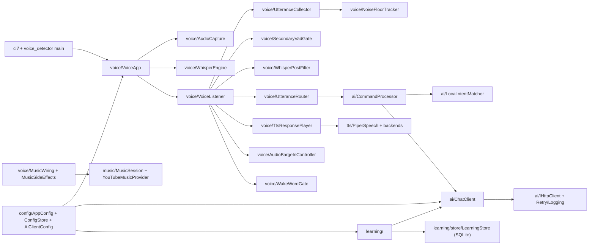

# sound/ improvement plan — reliability + refactor (broad)

## Overview

Broad reliability + refactor plan across `sound/` — voice, ai, learning, tts/music, and build/infra — anchored on symptoms visible in live `voice_detector` runs and cross-cutting smells from code review.

### Checklist (work items)

- **A1:** Harden `AUDIO_DEVICE_INDEX` parse + add post-open silent-device probe in VoiceApp/AudioCapture
- **A2:** Clamp continue threshold + add voiced-ratio early-close in UtteranceCollector
- **A3:** Post-Whisper alnum/no_speech cross-check + optional crest-factor check in SecondaryVadGate
- **A4:** Fix WakeWordGate thread-safety + log invalid `HECQUIN_WAKE_PHRASE` + add tests
- **A5:** Move TTS duck + thinking-delay magic numbers into `VoiceListenerConfig` / `AudioBargeInController::Config`
- **A6:** Replace per-utterance `std::thread` for thinking earcon with poll-loop timer / ThinkingScheduler
- **B1:** Switch `RetryingHttpClient` to `common/EnvParse`
- **B2:** Extract `resolve_int` helper + table-drive path keys in `AppConfig::load`
- **B3:** Move `HttpResult` / `http_post_json` into `hecquin::ai` (namespace boundaries)
- **B4:** Add ChatClient cooldown + AiClientConfig precedence tests
- **B5:** Fix `config/ai/README.md` drift
- **C1:** Add bounded LRU for RAG query embeddings in `RetrievalService`
- **C2:** Replace `EnglishTutorProcessor::process_async` / `std::async` with explicit worker or remove API
- **C3:** Tighten `PronunciationDrillProcessor` ownership for LearningStore/ProgressTracker
- **C4:** Document LearningStore single-threaded contract at the top of the header
- **D1:** Add WavReader edge tests + faked PlayPipeline streaming-to-buffered fallback test
- **D2:** Rename `sdl_play_s16_mono_22k` and similar to rate-agnostic forms
- **D3:** Defer “Now playing” until first audio frame or surface early-failure TTS
- **E1:** Add `CMakePresets.json` (debug/release/asan/ubsan), Ninja+ccache, `./dev.sh test` wrapper, consolidate `scripts/_lib.sh`, remove/rename `_fc_test.sh`
- **E2:** Confirm `.gitignore` for `.env/config.env`, add `config.env.example`, extend pre-commit hook
- **E3:** Add minimal GitHub Actions for build + ctest + clang-tidy warn lane

---

## Why these, and why now

Live `voice_detector` logs already exhibit failure modes worth fixing first:

- **Run 1:** `too_quiet` / `too_sparse` rejections and `max duration 15000 ms reached` — the continue threshold chases ambient noise; the safety net fires on noise rather than late speech.
- **Run 2 (after rebuild):** Two devices and `AUDIO_DEVICE_INDEX=-1`: “No microphone samples after ~2000 ms”, `floor=0.00167` — silent default device picked over a working headset.
- **Latent false-accept:** Transcription like “Our bill takes” with a generic reply — gates accept low-SNR garbage.

These map to concrete fixes in `voice/`, with focused refactors elsewhere.

## Code map (one screen)

---

## A. Voice subsystem — reliability first

### A1. Pick a real microphone instead of silently using a dead default

`AppConfig::load` parses `AUDIO_DEVICE_INDEX`; `AudioCapture::open` accepts the index without sampling first. Symptom: `AUDIO_DEVICE_INDEX=-1` can yield zero samples for ~2 s.

**Fixes:**

- Wrap parse in try/catch; warn on invalid values instead of aborting startup.
- After `SDL_OpenAudioDevice` succeeds, sample ~500 ms during init; if no samples when unpaused, log clearly and point users at the device list / `AUDIO_DEVICE_INDEX=<n>`.
- Emit chosen device in `[voice]`-style logs so structured log pipelines can grep it.

### A2. Stop the continue-threshold from chasing ambient noise

`UtteranceCollector::detect_voice_` uses `dynamic_continue_thr_ = k_continue * dynamic_start_thr_`. When the floor is low, room hiss can hold recording until `max_utterance_ms`.

**Fixes:**

- Absolute lower clamp on continue threshold (e.g. `HECQUIN_VAD_MIN_CONT_THR`).
- Short-window voiced-frame ratio; early-close when ratio falls below `min_voiced_ratio` before `end_silence_ms`.
- Pipeline event `vad_continue_clamped` (or equivalent) in telemetry.

### A3. Tighten the secondary gate (noise → bogus transcripts)

`SecondaryVadGate` rejects on mean RMS / voiced ratio; loud noise can still pass and Whisper hallucinates.

**Fixes:**

- Post-Whisper: min alphanumeric count + `no_speech_prob` band cross-check before routing to cloud LLM.
- Optional crest-factor check in `SecondaryVadGate` for wide-band noise.

### A4. WakeWordGate thread-safety + invalid regex

Ensure concurrent `decide` vs `apply_env_overrides` is safe; log invalid `HECQUIN_WAKE_PHRASE`. Unit tests: prefix strip, window, PTT, invalid regex degrad gracefully.

### A5. Centralise voice timing / ducking knobs

Move TTS duck ramps / thinking earcon delay from magic numbers into `VoiceListenerConfig` / `AudioBargeInController::Config` with env overrides.

### A6. Reduce thinking-thread churn

Replace per-utterance `std::thread` for the thinking earcon with a single re-armable worker (e.g. `ThinkingScheduler`) or poll-loop timer.

---

## B. AI / config — refactor + small reliability

### B1. One env-parsing story

Use `hecquin::common::env::*` / `EnvParse.hpp` in `RetryingHttpClient` (and align log prefixes where useful).

### B2. Tighten `AppConfig::load`

Extract `resolve_int` (optionally bounded min/max); table-drive path-anchored string keys to avoid drift.

### B3. Namespace + boundaries

Keep `HttpResult` and `http_post_json` under `hecquin::ai`; align related types.

### B4. Test gaps

ChatClient cooldown + 4xx vs 5xx; `AiClientConfig::from_store` precedence; WakeWordGate (see A4).

### B5. README doc drift

Align `config/ai/README.md` with actual `AiClientConfig` fields and retry env names (`HECQUIN_HTTP_RETRY_*`, etc.).

---

## C. Learning — quick wins

### C1. Cache RAG query embeddings

Bounded LRU in `RetrievalService` keyed by normalised query text.

### C2. English tutor async

Avoid raw `std::async` capturing `this` without join semantics; sync-only API or explicit worker + `stop()`.

### C3. Drill processor ownership

Prefer `std::optional<std::reference_wrapper<…>>` or non-null construction for store / progress dependencies.

### C4. LearningStore documentation

State single-threaded contract in `LearningStore.hpp`.

---

## D. TTS / Music

### D1. Tests

WavReader edge cases; PlayPipeline streaming → buffered fallback (faked backend).

### D2. Naming

Rename `sdl_play_s16_mono_22k` / `play_mono_22k` to rate-agnostic names; sample rate from WAV / `kPiperSampleRate`.

### D3. Music early-failure UX

Defer “Now playing” until first decoded PCM (or similar handshake); or corrective TTS on immediate pipeline failure.

---

## E. Build / dev workflow / hygiene

### E1. Quick wins

- `CMakePresets.json`: debug, release, asan, ubsan, optional no-tests; Ninja + `ccache` where appropriate.
- `./dev.sh test [pattern]` wrapping `ctest`.
- Shared shell helpers in `scripts/_lib.sh`.
- Remove or rename orphan scripts (e.g. `_fc_test.sh` if unused).

### E2. Secrets hygiene

`.gitignore` for env files; `config.env.example`; pre-commit guard against committing populated `config.env`.

### E3. CI

GitHub Actions: Linux (and optionally macOS) build + `ctest`; optional clang-tidy / format informational lane.

---

## Suggested execution order

1. **A1, A2, A3** — biggest perceived improvement on the next voice run.
2. **A4** + **B1, B2** — correctness and logging.
3. **A5, A6** + **D2** — housekeeping while touching voice.
4. **B4**, **D1** — tests for touched areas.
5. **C1–C4** — learning polish.
6. **E1–E3** — build/CI/hygiene (E1 can be pulled earlier for faster iteration).

---

## Out of scope (this plan)

- Replacing `Action` with `std::variant` (large cross-module change).
- i18n of vocabulary normalisation / tokenizer.
- Repo-wide migration off `std::cerr` (opportunistic only).
