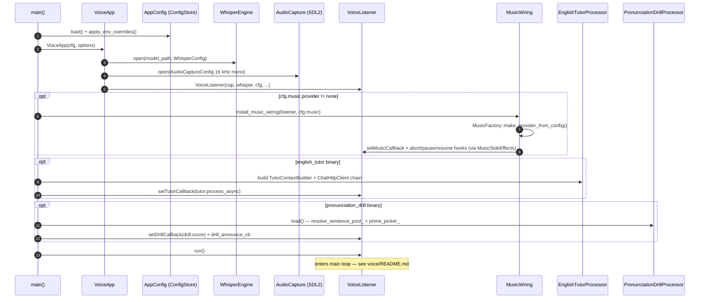
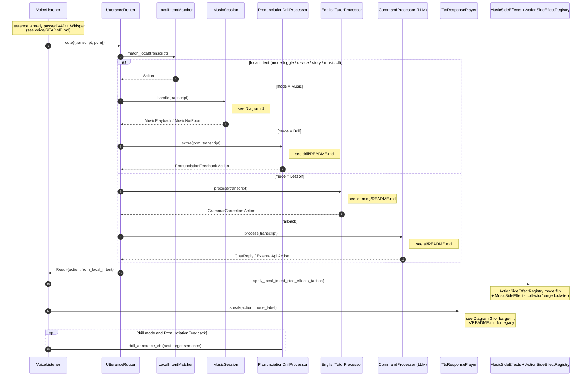
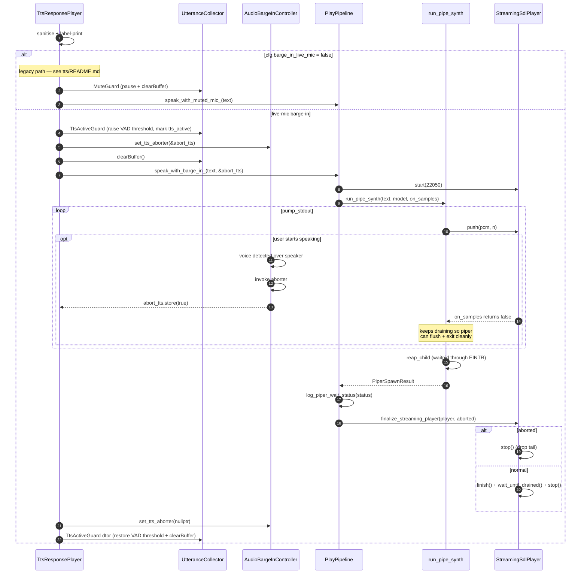
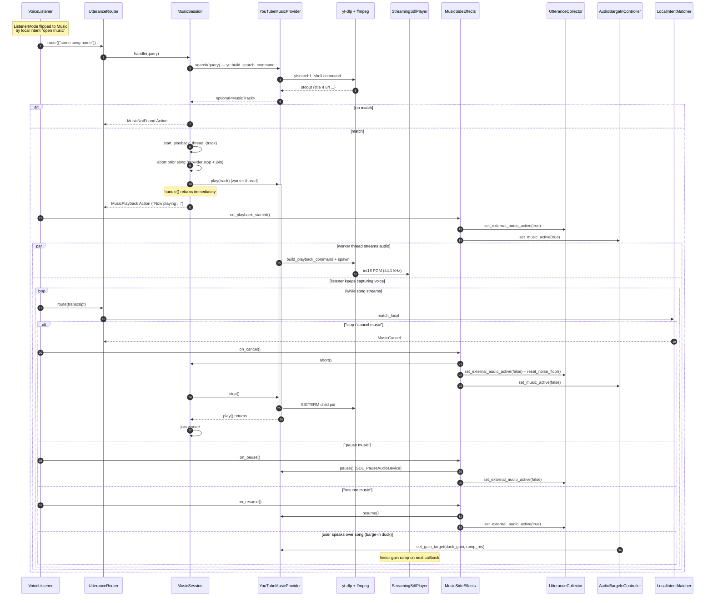

# `sound/` Sequence Diagrams

End-to-end Mermaid sequence diagrams for the `sound/` module.  This file
**only documents flows that are not already drawn elsewhere** — every
existing per-module diagram is linked from the index below instead of
re-rendered.

## Existing diagrams (single source of truth)

| Flow                                   | Location                                                                                          |
|----------------------------------------|---------------------------------------------------------------------------------------------------|
| `VoiceListener::run` main loop         | [`src/voice/README.md`](./src/voice/README.md#sequence-diagram--voicelistenerrun-loop)            |
| `piper_speak_and_play_streaming` (legacy) | [`src/tts/README.md`](./src/tts/README.md#sequence-diagram--piper_speak_and_play_streaming)    |
| `CommandProcessor::process` (chat fallback) | [`src/ai/README.md`](./src/ai/README.md#sequence-diagram--commandprocessorprocess)            |
| `EnglishTutorProcessor::process` (RAG) | [`src/learning/README.md`](./src/learning/README.md#sequence-diagram--englishtutorprocessorprocess) |
| `PronunciationDrillProcessor::score`   | [`src/learning/pronunciation/drill/README.md`](./src/learning/pronunciation/drill/README.md#sequence-diagram--pronunciationdrillprocessorscore) |
| `ListenerMode` state transitions       | [`src/voice/README.md`](./src/voice/README.md#state-diagram--listenermode)                        |
| `UtteranceCollector` collect FSM       | [`src/voice/README.md`](./src/voice/README.md#state-diagram--utterancecollector)                  |
| `StreamingSdlPlayer` playback FSM      | [`src/tts/README.md`](./src/tts/README.md#state-diagram--streamingsdlplayer)                      |

The diagrams below cover the **gaps**: boot, cross-cutting voice-turn
choreography, the live-mic TTS barge-in path, and music streaming with
mid-song voice control.

---

## 1. Boot — bringing one voice executable up

Shared startup path for `voice_detector`, `english_tutor`, and
`pronunciation_drill`.  `english_ingest` and `text_to_speech` skip the
listener wiring; everything else funnels through `VoiceApp`.

---

## 2. Cross-cutting voice turn — who calls whom across modules

The `voice/README.md` loop diagram shows the per-iteration shape.  This
diagram zooms out and shows **how the four mode handlers fan out into
the rest of the codebase** for one accepted utterance.  Per-handler
detail is in the linked diagrams (don't duplicate them here).

---

## 3. TTS playback — `speak()` with live-mic barge-in

`tts/README.md` already shows the basic `piper_speak_and_play_streaming`
sequence (Piper child + push callback + prebuffer).  This diagram
adds the **barge-in delta**: the abort fuse, raised VAD threshold, and
how the read loop bails when the user starts speaking over the
assistant.  The `else` branch falls back to the legacy mute-mic path
already drawn in tts/README.md.

---

## 4. Music — streaming + mid-song voice commands

`MusicSession::handle` is non-blocking: search runs synchronously, then
`provider.play()` is dispatched to a background thread so the listener
keeps capturing voice and routing `MusicCancel / MusicPause /
MusicResume` against the running song.  The mic stays **live** during
playback (no `MuteGuard`) — speaker bleed is suppressed by the
`MusicSideEffects` lock-step on `UtteranceCollector` +
`AudioBargeInController`.

---

## How the diagrams connect

- **(1) Boot** ends at `Lst.run()` — enter the loop in
  [`voice/README.md`](./src/voice/README.md#sequence-diagram--voicelistenerrun-loop).
- The loop's accepted-utterance branch enters **(2)** here.
- **(2)** dispatches into one of the per-handler diagrams listed in the
  index, then back into the side-effect lane and **(3)**.
- **(2)** entering Music mode expands into **(4)**.
- `MusicSideEffects.on_*` calls in **(4)** are the same hooks invoked
  from `apply_local_intent_side_effects_` in **(2)**.
