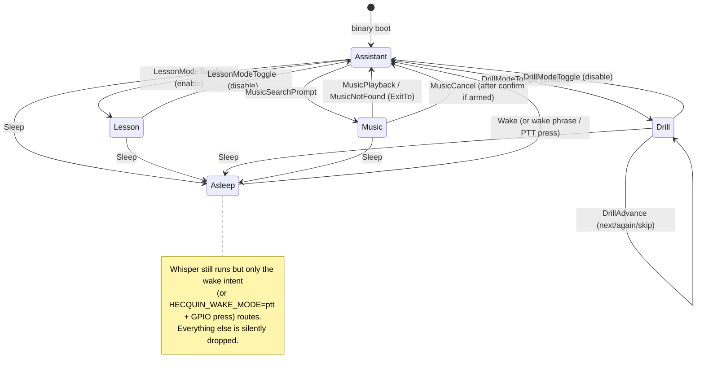
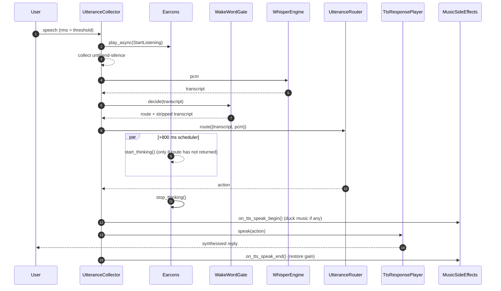
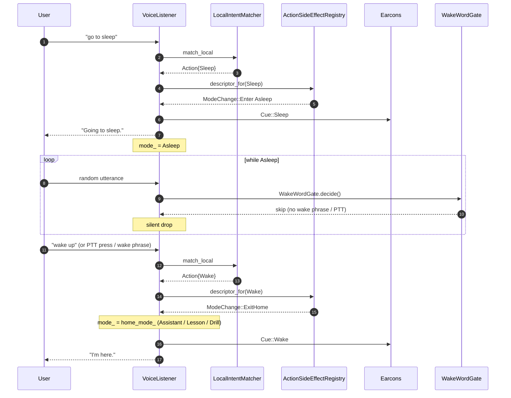
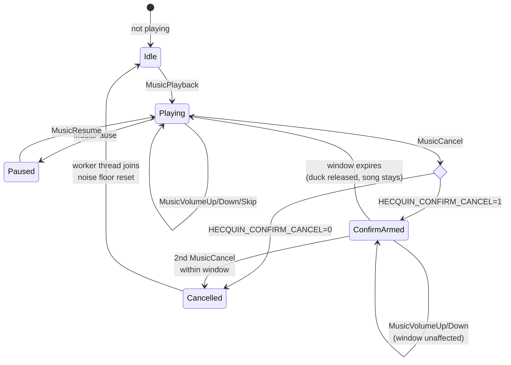
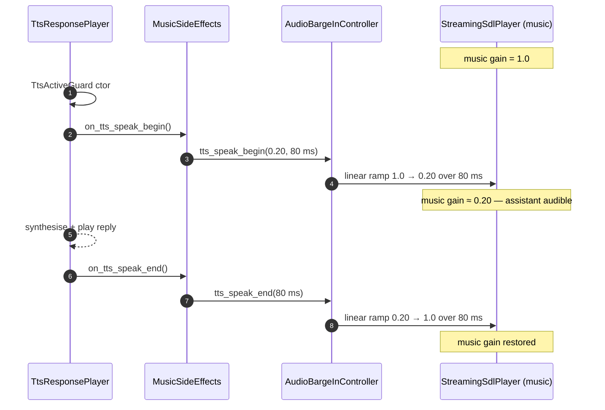
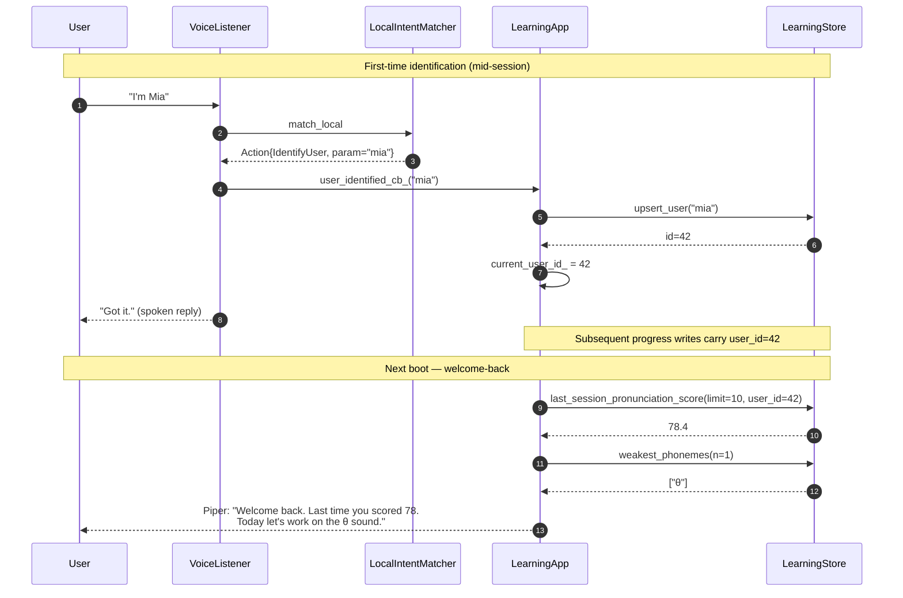

# `sound/` UX Flow — Voice-First Conversation Layer

This document covers the **conversation-quality layer** layered on top of
the core capture / VAD / Whisper / TTS pipeline.  It is the developer
reference for the four-tier UX flow advisory implemented across the
`voice/`, `actions/`, `ai/` and `learning/` subsystems.

For the underlying audio pipeline (capture → VAD → Whisper → router →
Piper) start at [`ARCHITECTURE.md`](./ARCHITECTURE.md).
For per-call sequence diagrams (boot, voice turn, TTS barge-in, music
streaming) start at [`SEQUENCE_DIAGRAMS.md`](./SEQUENCE_DIAGRAMS.md).

---

## 1. Why a UX layer?

Voice-only assistants lose users to silence: the user can't tell whether
the system heard them, is thinking, or has fallen over.  The four
collaborators added under `src/voice/` close that loop without a screen:

| Concern                                 | Collaborator                                                              | What the user perceives                                          |
|-----------------------------------------|---------------------------------------------------------------------------|------------------------------------------------------------------|
| Was I heard? (VAD pass / fail)          | `Earcons` (synthesised, ≤200 ms tones)                                    | Soft rising blip on speech start, falling blip on rejection      |
| Is something happening? (LLM tail)      | `Earcons::start/stop_thinking` + `+800 ms` scheduler                      | "Still working" pulse only when the call is genuinely slow      |
| What mode am I in?                      | `ModeIndicator` (mode-tinted earcon, swappable for GPIO/LED)              | One-shot cue on every Assistant ↔ Lesson ↔ Drill ↔ Music ↔ Asleep |
| Can I interrupt?                        | `ActionSideEffectRegistry.aborts_tts` + `AudioBargeInController`          | "stop / shut up / never mind" cuts Piper mid-reply              |
| When does mic listen vs ignore?         | `WakeWordGate` (Always / WakeWord / Ptt)                                  | Optional wake phrase + sleep / wake intents                     |
| Is this for me?                         | `LearningStore::users` + `IdentifyUser` action + welcome-back recap       | "I'm Mia" → next session opens with "Welcome back. Last time …" |

Every collaborator stays **opt-in** by default-preserving the existing
behaviour: an env knob (`HECQUIN_EARCONS=0`, `HECQUIN_WAKE_MODE=ptt`,
`HECQUIN_DRILL_AUTO_ADVANCE=0`, `HECQUIN_CONFIRM_CANCEL=1`) flips it on
the moment it's set.

---

## 2. Tier overview

| Tier | Theme                          | What it shipped                                                                                                                                                                                                                                              |
|-----:|--------------------------------|-----------------------------------------------------------------------------------------------------------------------------------------------------------------------------------------------------------------------------------------------------------|
| 1    | Quick wins                     | Earcons (StartListening / VadRejected / Acknowledge / NetworkOffline), universal `AbortReply` (cuts in-flight TTS), TTS-ducks-music coordination, `Help` intent, Piper prewarm                                                                                |
| 2    | Conversational quality         | `NoiseFloorTracker` wired into adaptive VAD, `Earcons::Thinking` latency masking (+800 ms gate), drill ready-gate (`DrillAdvance` intent + `HECQUIN_DRILL_AUTO_ADVANCE=0`), media controls (`MusicVolumeUp/Down`, `MusicSkip`), `ModeIndicator` on every flip |
| 3    | Reliability                    | Boot capability summary (`VoiceApp::speak_capability_summary`), configurable cancel-confirm window for music (`HECQUIN_CONFIRM_CANCEL`), network cooldown / fallback messaging on repeated 5xx                                                              |
| 4    | Privacy + engagement           | `WakeWordGate` (Always / WakeWord / Ptt), `Sleep` / `Wake` intents + `ListenerMode::Asleep`, per-user namespacing in `LearningStore` (`users` + nullable `user_id`), welcome-back recap on boot                                                              |

---

## 3. Source layout — added or extended files

```
src/
├── actions/
│   └── ActionKind.hpp                       — added DrillAdvance, AbortReply, Help, Sleep, Wake, IdentifyUser,
│                                              MusicVolumeUp/Down, MusicSkip
├── ai/
│   └── LocalIntentMatcher.{hpp,cpp}         — new patterns: drill_advance, abort, help, sleep, wake,
│                                              identify_user, music_volume_*/skip
├── voice/
│   ├── Earcons.{hpp,cpp}                    — synthesised tone bank + thinking pulse
│   ├── WakeWordGate.{hpp,cpp}               — Always / WakeWord / Ptt routing decision
│   ├── ModeIndicator.{hpp,cpp}              — mode-tinted earcon (default impl); subclass for GPIO/LED
│   ├── MusicSideEffects.{hpp,cpp}           — extended: confirm-cancel state, TTS-duck hooks,
│   │                                          volume/skip forwards
│   ├── ActionSideEffectRegistry.{hpp,cpp}   — added Sleep / Wake / AbortReply rows + ExitHome ModeChange
│   ├── ListenerMode.hpp                     — added Asleep
│   └── VoiceListener.{hpp,cpp}              — wires Earcons + WakeWordGate + ModeIndicator,
│                                              schedules thinking earcon, handles sleep/wake/abort
├── voice/
│   └── VoiceApp.{hpp,cpp}                   — speak_capability_summary() (boot), Piper prewarm
└── learning/
    ├── store/
    │   ├── LearningStore.{hpp,cpp}          — upsert_user, last_session_pronunciation_score
    │   ├── LearningStoreMigrations.cpp      — v3 users table + nullable user_id columns
    │   └── LearningStorePronunciation.cpp   — user-aware queries
    └── cli/
        └── LearningApp.{hpp,cpp}            — wire_user_identification, speak_welcome_back
```

---

## 4. UX collaborators in detail

### 4.1 `Earcons` — non-spoken audio acknowledgements

Cue bank (`enum class Earcons::Cue`):

```
StartListening   rising blip       VAD opened
VadRejected      soft falling blip secondary gate dropped utterance
Thinking         soft pulse        ~0.7 Hz while LLM call is in flight
NetworkOffline   warble            boot or repeated 5xx / timeout
Acknowledge      short chirp       AbortReply / mode toggles before TTS
Sleep            falling chord     entering Asleep
Wake             rising chord      leaving Asleep
```

Tones are synthesised in-process so no `.wav` assets ship by default; an
optional override directory (`HECQUIN_EARCONS_DIR`) lets a deployment
ship custom WAVs (mono int16, 22050 Hz) keyed by name.

The thinking pulse is started by a one-shot `+800 ms` scheduler around
`UtteranceRouter::route(...)` — fast local-intent / cached-answer routes
return well before the deadline so the user never hears it; only slow
LLM round-trips get the "still working" cue.

### 4.2 `WakeWordGate` — Always / WakeWord / Ptt

```
HECQUIN_WAKE_MODE=always      every transcript routes (default; legacy behaviour)
HECQUIN_WAKE_MODE=wake_word   transcripts must start with — or arrive within
                              HECQUIN_WAKE_WINDOW_MS (default 8000) of — a
                              configurable wake phrase (HECQUIN_WAKE_PHRASE).
                              The phrase is stripped before the router sees it.
HECQUIN_WAKE_MODE=ptt         push-to-talk: only routes while a hardware GPIO
                              pin (or scripted set_ptt_pressed) is held.
```

The gate is consulted *after* Whisper but *before* the router and
side-effect registry, so it cannot disagree with the listener's mode
state machine.

### 4.3 `ModeIndicator` — short cue per mode change

```cpp
mode_indicator_->notify(ListenerMode::Drill);   // plays Drill-tinted earcon
```

Default implementation is a tiny mode-tinted variant of
`Earcons::Cue::StartListening`.  GPIO / LED implementations subclass and
override `notify` — `VoiceListener::set_mode_indicator(...)` swaps the
implementation behind the same call site.

### 4.4 `MusicSideEffects` — extended

The pre-existing `on_playback_started / on_pause / on_resume / on_cancel`
hooks gained:

| Hook                           | Tier | Purpose                                                                                          |
|--------------------------------|------|--------------------------------------------------------------------------------------------------|
| `on_volume_up / on_volume_down`| 2    | Forward `VolumeStepCallback(±1)` to the provider; default `YouTubeMusicProvider` honours via SDL gain |
| `on_skip`                      | 2    | Forward `SkipCallback()` to the provider; provider may treat as stop + next pick                 |
| `on_tts_speak_begin / end`     | 1    | Ramp music down to `tts_duck_gain_` while Piper speaks; restored on speak-end                    |
| `set_confirm_cancel`           | 3    | Two-step cancel: first `MusicCancel` ducks + arms a window, second within window aborts          |

`apply_env_overrides()` honours `HECQUIN_CONFIRM_CANCEL=1` /
`HECQUIN_CONFIRM_CANCEL_MS` so a deployment can opt in without
recompiling.

### 4.5 `ActionSideEffectRegistry` — additional rows

```
LessonModeToggle    EnterIfEnable Lesson
DrillModeToggle     EnterIfEnable Drill              + sets_pending_drill
MusicSearchPrompt   Enter         Music
MusicPlayback       ExitTo        Music              on_playback_started
MusicNotFound       ExitTo        Music              on_playback_not_found
MusicCancel         ExitTo        Music              on_cancel
MusicPause/Resume   None                             on_pause / on_resume
MusicVolumeUp/Down  None                             on_volume_up / down
MusicSkip           None                             on_skip
AbortReply          None                                                            aborts_tts=true
Sleep               Enter         Asleep
Wake                ExitHome      Asleep
```

`aborts_tts` is the new opt-in flag the listener honours by calling
`barge_.abort_tts_now()` on the action.  `ExitHome` falls through to
Assistant when the user's home mode *is* the mode they're "leaving"
(prevents getting stuck if `home_mode_ == Asleep`).

### 4.6 `LearningStore` — per-user namespacing (schema v3)

```sql
-- v3 (Tier-4 #16)
CREATE TABLE users (
  id INTEGER PRIMARY KEY AUTOINCREMENT,
  display_name TEXT NOT NULL UNIQUE,
  voice_embedding_blob BLOB,                     -- reserved: speaker-id v2
  created_at INTEGER NOT NULL
);

-- backwards-compat ALTERs (NULL = "default user")
ALTER TABLE interactions           ADD COLUMN user_id INTEGER REFERENCES users(id);
ALTER TABLE pronunciation_attempts ADD COLUMN user_id INTEGER REFERENCES users(id);
```

Migrations are idempotent: a `pragma_table_info('…')` probe before each
`ADD COLUMN` so re-running on an already-migrated DB is a no-op.

Two new façade methods consume the table:

| Method                                                    | Returns         | Used by                                  |
|-----------------------------------------------------------|-----------------|------------------------------------------|
| `upsert_user(display_name)`                               | `optional<id>`  | `IdentifyUser` callback (`LearningApp`)  |
| `last_session_pronunciation_score(limit, user_id?)`       | `optional<avg>` | `speak_welcome_back()`                   |

---

## 5. Diagrams

### 5.1 Mode state machine (with `Asleep`)



### 5.2 Per-utterance UX cue timeline (success path)



### 5.3 Per-utterance UX cue timeline (rejection / abort)

```mermaid
sequenceDiagram
    autonumber
    participant U as User
    participant Col as UtteranceCollector
    participant E as Earcons
    participant Gate as SecondaryVadGate
    participant Reg as ActionSideEffectRegistry
    participant Barge as AudioBargeInController

    rect rgb(245, 230, 230)
    Note over U,Gate: VAD rejection path
    U->>Col: speech (too quiet / too sparse)
    Col->>Gate: evaluate_secondary_gate
    Gate-->>Col: skip (too_quiet / too_sparse)
    Col->>E: play_async(VadRejected)
    Col-->>U: (no Whisper, no router, no TTS)
    end

    rect rgb(230, 245, 235)
    Note over U,Barge: Universal abort (mid-reply)
    U->>Col: "stop" / "shut up" / "never mind"
    Col->>Reg: descriptor_for(AbortReply)
    Reg-->>Col: aborts_tts = true
    Col->>Barge: abort_tts_now()
    Col->>E: play_async(Acknowledge)
    Note over Barge: in-flight Piper synth fuse fires;<br>StreamingSdlPlayer drains and stops
    end
```

### 5.4 Sleep / Wake cycle



### 5.5 Music confirm-cancel state machine



### 5.6 TTS-ducks-music gain timeline



### 5.7 Drill ready-gate (auto-advance off)

```mermaid
flowchart TD
    A[PronunciationFeedback action] -->|spoken by TTS| B{HECQUIN_DRILL_AUTO_ADVANCE}
    B -- 1 default --> C[announce next sentence immediately]
    B -- 0 --> D[set pending_drill_announce_<br>but DO NOT flush]
    D --> E((wait for user))
    E -->|"next" / "again" / "skip"| F[DrillAdvance action]
    F -->|maybe_announce_drill_| G[flush pending announce<br>+ MuteGuard mic]
    G --> H[next reference sentence spoken]
    E -->|"exit drill" / "stop drill"| I[DrillModeToggle disable<br>drop pending]
```

### 5.8 User identification + welcome-back recap



---

## 6. Configuration knobs

All knobs are optional; defaults preserve the pre-Tier-1 behaviour.

| Variable                          | Default | Purpose                                                                                  |
|-----------------------------------|---------|------------------------------------------------------------------------------------------|
| `HECQUIN_EARCONS`                 | `1`     | `0` disables every earcon (synthesised tones + thinking pulse)                           |
| `HECQUIN_EARCONS_DIR`             | unset   | Override `<name>.wav` files (mono int16, 22050 Hz) loaded by name on first use           |
| `HECQUIN_WAKE_MODE`               | `always`| `always` \| `wake_word` \| `ptt`                                                         |
| `HECQUIN_WAKE_PHRASE`             | `hecquin\|hey hecquin\|hi hecquin\|hello hecquin` | Wake phrase regex alternation                          |
| `HECQUIN_WAKE_WINDOW_MS`          | `8000`  | After a wake-phrase detection, follow-on transcripts route for this many ms              |
| `HECQUIN_DRILL_AUTO_ADVANCE`      | `1`     | `0` waits for an explicit `DrillAdvance` ("next" / "again" / "skip") before next sentence|
| `HECQUIN_CONFIRM_CANCEL`          | `0`     | `1` enables the two-step `MusicCancel` confirmation                                      |
| `HECQUIN_CONFIRM_CANCEL_MS`       | `1200`  | Confirmation window length                                                               |
| `HECQUIN_DUCK_GAIN`               | `0.20`  | Music gain target while TTS speaks (linear, 0..1)                                        |
| `HECQUIN_DUCK_RAMP_MS`            | `80`    | Linear ramp duration each side of the speak-begin / speak-end boundary                   |
| `HECQUIN_TTS_BARGE_IN`            | `0`     | `1` enables live-mic barge-in (raised VAD threshold instead of mute) — see TTS diagram   |

---

## 7. Testing

Unit tests added / extended (see `tests/`):

| Test                                         | What it asserts                                                                  |
|----------------------------------------------|----------------------------------------------------------------------------------|
| `test_local_intent_matcher.cpp`              | New patterns: `abort` precedes `music_cancel`, `drill_advance` only matches whole utterance, `identify_user` captures the name in group 1, `sleep` / `wake` / `help` |
| `test_music_side_effects.cpp` *(new)*        | Confirm-cancel state machine: first cancel ducks + arms, second within window aborts, expiry releases the duck.  TTS-duck hooks are idempotent. Volume / skip forwards. |
| `test_utterance_router.cpp`                  | Chain order unchanged + Asleep mode drops everything except `Wake` action through wake gate |
| `test_music_session.cpp`                     | Volume / skip provider forwards (best-effort) + cancel still aborts a running session |
| `test_content_fingerprint.cpp`               | Self-contained build: only `ContentFingerprint.cpp` is compiled into the test executable so no transitive `libcurl` dependency lands in the Mach-O on macOS (avoided an AMFI / Gatekeeper SIGKILL on small ad-hoc-signed binaries — see `cmake/sound_tests.cmake` comment). |

The full `ctest --output-on-failure` suite runs in CI on
`ubuntu-latest` and `macos-latest` and stays at 100% green after the
plan landed (35 / 35 tests passed).

---

## 8. How this connects to existing docs

- [`ARCHITECTURE.md`](./ARCHITECTURE.md) — components / source layout / SQLite schema.  This file extends the
  *Component Details* and *SQLite schema* sections with the v3 `users` table and the UX collaborators listed
  above without restating the underlying pipeline.
- [`SEQUENCE_DIAGRAMS.md`](./SEQUENCE_DIAGRAMS.md) — call-flow diagrams.  The diagrams in §5 above zoom in on
  the UX cues; SEQUENCE_DIAGRAMS.md owns the cross-cutting voice-turn diagram which already references
  these collaborators (Earcons, ModeIndicator, MusicSideEffects).
- [`README.md`](./README.md) — user guide.  The env-var table in §6 above is mirrored in the README's
  configuration section so a deployer doesn't have to read code.
