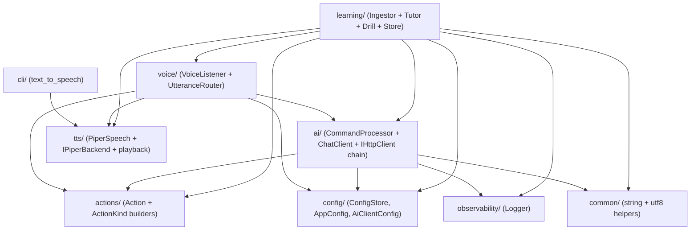

# `sound/src/` — per-module documentation

Every sub-folder under `src/` contains one short `README.md` describing its
purpose, the files inside it, and any design patterns it uses. This page is
the entry point.

For the holistic view — data-flow diagrams, SQLite schema, threading model,
CMake internals, and the full Source Layout tree — see
[`../ARCHITECTURE.md`](../ARCHITECTURE.md).

## Top-level folders

| Folder | Purpose |
|---|---|
| [`actions/`](./actions/README.md) | `ActionKind` enum + typed `Action` structs returned by the routing layer |
| [`ai/`](./ai/README.md) | HTTP transport, decorators (retry / logging), chat client, local-intent matcher, command processor |
| [`cli/`](./cli/README.md) | `text_to_speech` executable entry point |
| [`common/`](./common/README.md) | Tiny header-only utilities (string, UTF-8) |
| [`config/`](./config/README.md) | Runtime configuration: `ConfigStore`, `AppConfig`, `AiClientConfig` |
| [`learning/`](./learning/README.md) | English tutor + pronunciation drill subsystem — embeddings, ingest, RAG, SQLite store, pronunciation & prosody |
| [`observability/`](./observability/README.md) | Structured logger (pretty / JSON) |
| [`tts/`](./tts/README.md) | Piper TTS facade + Strategy-based synthesis backends + SDL playback |
| [`voice/`](./voice/README.md) | Microphone capture, VAD, Whisper wrapper, and the listener orchestrator (Chain of Responsibility router) |

## Sub-folders

| Folder | Purpose |
|---|---|
| [`config/ai/`](./config/ai/README.md) | OpenAI-compatible HTTP client settings |
| [`learning/cli/`](./learning/cli/README.md) | `LearningApp` bootstrap + `english_ingest` / `english_tutor` / `pronunciation_drill` entry points |
| [`learning/ingest/`](./learning/ingest/README.md) | File discovery, fingerprinting, chunking strategy, embedding batching, document persistence, CLI progress |
| [`learning/pronunciation/`](./learning/pronunciation/README.md) | wav2vec2 + CTC forced alignment + GOP scoring |
| [`learning/pronunciation/drill/`](./learning/pronunciation/drill/README.md) | Drill collaborators — sentence picker, reference-audio LRU, scoring pipeline, progress logger |
| [`learning/prosody/`](./learning/prosody/README.md) | YIN pitch tracker + semitone DTW intonation scorer |
| [`learning/store/`](./learning/store/README.md) | SQLite-backed persistence (single-connection facade) |
| [`learning/store/detail/`](./learning/store/detail/README.md) | Per-aggregate free-function headers that the façade forwards to |
| [`learning/store/internal/`](./learning/store/internal/README.md) | Private RAII helpers (`StmtGuard`, `Transaction`, `prepare_or_log`, …) |
| [`tts/backend/`](./tts/backend/README.md) | `IPiperBackend` Strategy + pipe / shell / composite-fallback implementations |
| [`tts/playback/`](./tts/playback/README.md) | SDL audio device + buffered / streaming players |
| [`tts/runtime/`](./tts/runtime/README.md) | One-time `DYLD_FALLBACK_LIBRARY_PATH` configuration for macOS |
| [`tts/wav/`](./tts/wav/README.md) | Generic 44-byte WAV reader (promoted out of the Piper public header) |

## Cross-cutting conventions

- **Facade + detail free functions** — `PiperSpeech`, `PronunciationDrillProcessor`, `VoiceListener`, `Ingestor`, and `LearningStore` are all thin coordinators. Each one has a sub-folder with the real collaborators so tests can substitute a fake without touching the façade.
- **Strategy** — TTS backends (`tts/backend/`) and ingest chunkers (`learning/ingest/ChunkingStrategy`).
- **Template Method** — Piper process-spawn skeleton (`tts/backend/PiperSpawn`) and drill scoring pipeline (`learning/pronunciation/drill/DrillScoringPipeline`).
- **Chain of Responsibility** — `voice/UtteranceRouter` (local-intent → drill → tutor → chat).
- **RAII** — microphone capture's `MuteGuard`, `WhisperEngine`'s `whisper_context`, SQLite `StmtGuard` / `Transaction`, `CachedStmt`.
- **Optional dependencies guarded by CMake** — `HECQUIN_WITH_SQLITE`, `HECQUIN_WITH_CURL`, `HECQUIN_WITH_ONNX`. Every module degrades gracefully when its optional dependency is missing.

## UML — component diagram

High-level package view of the folders below `src/` and the direction of
their dependencies. Each folder owns its own per-subsystem class /
sequence / state diagrams in its README.

