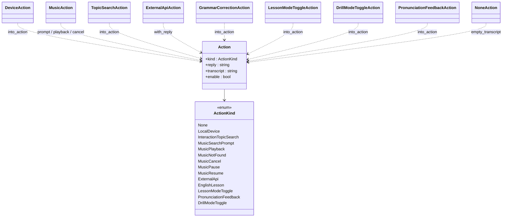

# `actions/`

Typed action values produced by the routing layer and consumed by
`voice/VoiceListener` + the English tutor / drill processors. Header-only
— every action is a small POD-ish struct that carries a short spoken
reply plus whatever extra context the caller needs to react.

## Files

| File | Purpose |
|---|---|
| `ActionKind.hpp` | `enum class ActionKind` — `None`, `LocalDevice`, `InteractionTopicSearch`, `MusicSearchPrompt`, `MusicPlayback`, `MusicNotFound`, `MusicCancel`, `MusicPause`, `MusicResume`, `ExternalApi`, `EnglishLesson`, `LessonModeToggle`, `PronunciationFeedback`, `DrillModeToggle`. |
| `Action.hpp` | The canonical value type: `{ kind, reply, transcript, enable }`. `enable` is only meaningful for the two `*ModeToggle` kinds (set by `LocalIntentMatcher`). Includes `actionKindLabel(ActionKind)` for logs. |
| `DeviceAction.hpp` | Smart-home style confirmations (`"turning the air on"`). |
| `ExternalApiAction.hpp` | Wraps the chat-completion reply when nothing local matched. |
| `TopicSearchAction.hpp` | Prompt to the learner to choose a story / topic. |
| `MusicAction.hpp` | Music intent — static factories `prompt()` / `playback(ok, title)` / `cancel()` that drive the two-turn "open music → song name → play" flow. |
| `GrammarCorrectionAction.hpp` | The tutor's parsed "You said / Better / Reason" triple. |
| `PronunciationFeedbackAction.hpp` | Drill score + weakest-phoneme feedback; doubles as the `DrillModeToggle` carrier. |
| `NoneAction.hpp` | Empty-transcript guard. |

## How these get used

```
VoiceListener::run()
    └── UtteranceRouter::route()           ← picks a handler
         ├── CommandProcessor::match_local → returns std::optional<Action>
         ├── drill callback                → returns Action
         ├── tutor callback                → returns Action
         └── CommandProcessor::process     → returns Action (fallback chat)
```

The router's `Result::action` is then fed into `TtsResponsePlayer::speak(...)`.

## Notes

- Keep these headers dependency-free — no SDL, no curl, no SQLite. They are
  included into every tier of the project.
- When adding a new `ActionKind`, update `actionKindLabel` in
  `Action.hpp` so logs stay readable.

See also: [`../ai/README.md`](../ai/README.md) for how routing produces
actions, and [`../voice/README.md`](../voice/README.md) for how they are
consumed.

## UML — class diagram

`Action` is a single flat struct (no polymorphism, no `std::variant`);
each `*Action` builder is a small POD that produces an `Action` via
`into_action(...)` or a static factory. The `kind` field is the
discriminator.


