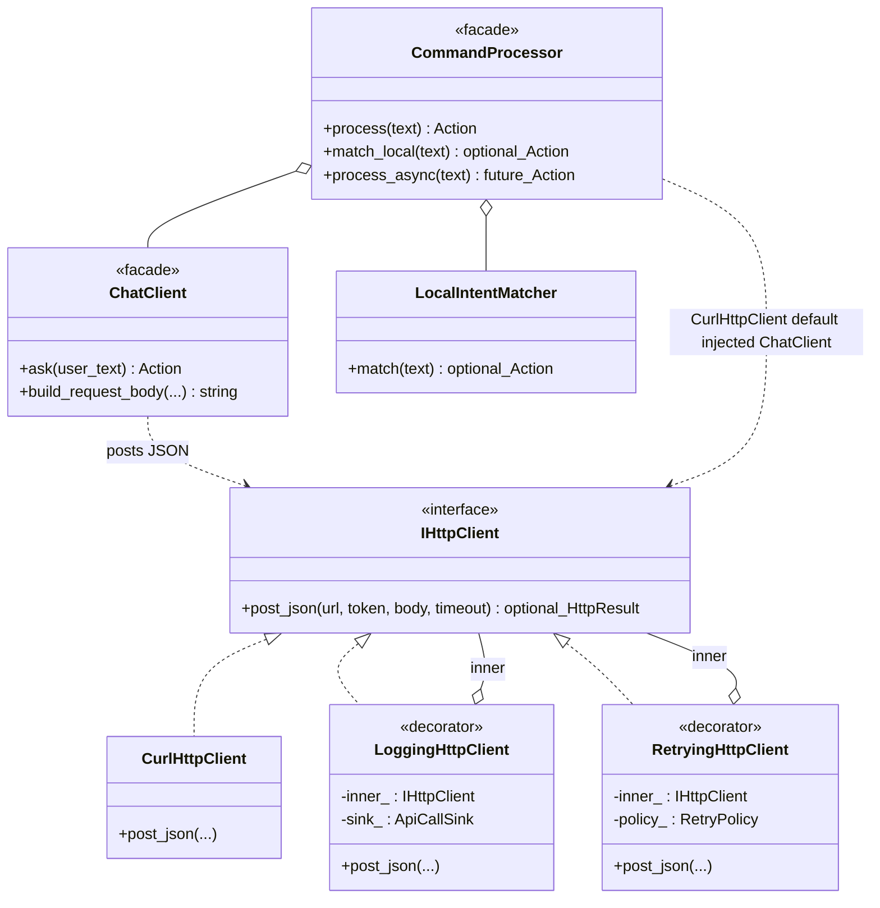
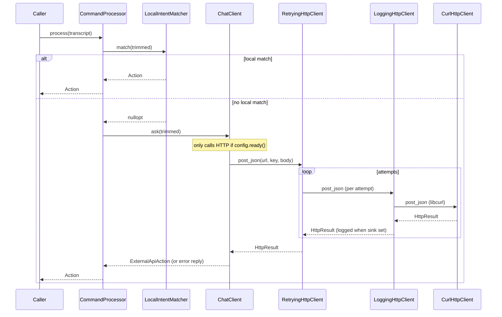

# `ai/`

HTTP transport + command-routing layer. Everything that talks to an external
LLM endpoint goes through this folder, plus the fast regex-based local
matcher that short-circuits the round-trip when the user said something the
robot can answer offline.

## Transport (decorator chain)

The **full** stack below is wired manually in `learning/cli` when SQLite
`api_calls` telemetry is desired. **`voice_detector`** does **not** use it:
its default `CommandProcessor` ctor owns a bare `CurlHttpClient`, so chat
completions are not logged to the learning DB.

```
RetryingHttpClient           (learning binaries — retries transient failures)
   └── LoggingHttpClient      (writes each attempt into `api_calls` when a sink is set)
        └── CurlHttpClient    (libcurl POST)
```

| File | Purpose |
|---|---|
| `IHttpClient.hpp` | Abstract `post_json(url, bearer, body, timeout)` returning `std::optional<HttpResult>` (nullopt = transport failure). |
| `HttpClient.hpp/cpp` | libcurl-backed `http_post_json` + `CurlHttpClient` adapter. |
| `LoggingHttpClient.hpp/cpp` | Decorator: emits an `ApiCallSink` record (status, latency, bytes, error) per call. Enables the `api_calls` pipeline without plumbing the sink through callers. |
| `RetryingHttpClient.hpp/cpp` | Decorator: exponential backoff on 5xx / 429 / transport failure with a configurable max-attempts budget. Collapses all retries into one terminal log row. |

## Command routing

| File | Purpose |
|---|---|
| `LocalIntentMatcher.hpp/cpp` | Case-insensitive regex matcher. Patterns come from `AppConfig::learning` (lesson/drill phrases) plus built-ins for device / story / music / UX intents. Returns a typed `std::optional<ActionMatch>` so the caller never has to re-run the regex to decide which toggle fired. Built-in patterns now cover: `device` (turn on/off), `story`, `music` (open/cancel/pause/resume/volume up/down/skip), `lesson_start/end`, `drill_start/end/advance`, `abort` (universal stop), `help`, `sleep` / `wake`, and `identify_user` (with name capture group). |
| `ChatClient.hpp/cpp` | OpenAI-compatible chat-completions client. Takes an `IHttpClient&` so tests can inject a canned response. |
| `CommandProcessor.hpp/cpp` | `match_local` then `ChatClient::ask` (blocking). Optional `process_async`; live path uses sync `process` through `UtteranceRouter`. Default ctor: owns `CurlHttpClient` and passes it to `ChatClient`. Override ctor: inject any `IHttpClient&` (used by `english_tutor` to pass the retry+logging stack). |
| `OpenAiChatContent.hpp/cpp` | `nlohmann::json` extractor that pulls `choices[0].message.content` out of responses regardless of which OpenAI-compat host produced them. |
| `HttpReplyBuckets.hpp/cpp` | Shared `short_reply_for_status(int)` → spoken-safe one-liner (`"I'm temporarily offline"`, `"temporarily unavailable"`, …). Used by both `ChatClient::ask` error paths and `EnglishTutorProcessor::call_llm_` to keep error replies consistent. |

## Tests

- `tests/test_openai_chat_content.cpp` — JSON extractor.
- `tests/test_local_intent_matcher.cpp` — full regex matrix.
- `tests/test_retrying_http.cpp` — exponential backoff + transient classification.

## Notes

- The whole transport chain is optional at configure time: when `libcurl`
  is not found, a stub `http_post_json` returns a "disabled" marker and
  `voice_detector` still links and runs, just without external AI.
- `LocalIntentMatcher` intentionally owns `thread_local` compiled regex
  objects so the hot path never re-compiles.
- The order of dispatch matters: `abort` is checked before `music_cancel`
  so a bare "stop" cuts the assistant off mid-reply (`AbortReply`)
  instead of being swallowed by the music branch (which only matches
  "stop music"). The `wake` pattern is consulted even while
  `ListenerMode::Asleep` so the user can address the assistant again.
- See [`../../UX_FLOW.md`](../../UX_FLOW.md) for the full intent-to-UX
  mapping including earcons, ducking, and confirm-cancel.

See [`../../ARCHITECTURE.md#commandprocessor`](../../ARCHITECTURE.md#commandprocessor)
for the full routing diagram.

## UML

### Class diagram — `IHttpClient` Decorator chain + `CommandProcessor`

The learning binaries construct
`RetryingHttpClient(LoggingHttpClient(CurlHttpClient))` with a
`StoreApiSink` when the DB opens — see
[`learning/cli/EnglishTutorMain.cpp`](../learning/cli/EnglishTutorMain.cpp)
(embed + chat each get their own `LoggingHttpClient` sharing the raw curl
adapter). **`voice_detector`**
([`voice/VoiceDetector.cpp`](../voice/VoiceDetector.cpp)) passes only
`AiClientConfig` into `CommandProcessor`, so the HTTP dependency is the
innermost `CurlHttpClient` only. Each `*Action` builder lives in
[`../actions/`](../actions/README.md) and emits an `Action` struct.



### Sequence diagram — `CommandProcessor::process`

Local intents short-circuit the chat call. When the matcher returns
`nullopt`, `ChatClient` issues an HTTP POST through whatever `IHttpClient`
was injected. The diagram shows the **learning** wiring; **`voice_detector`**
skips `RetryingHttpClient` / `LoggingHttpClient` and calls `CurlHttpClient`
directly.


