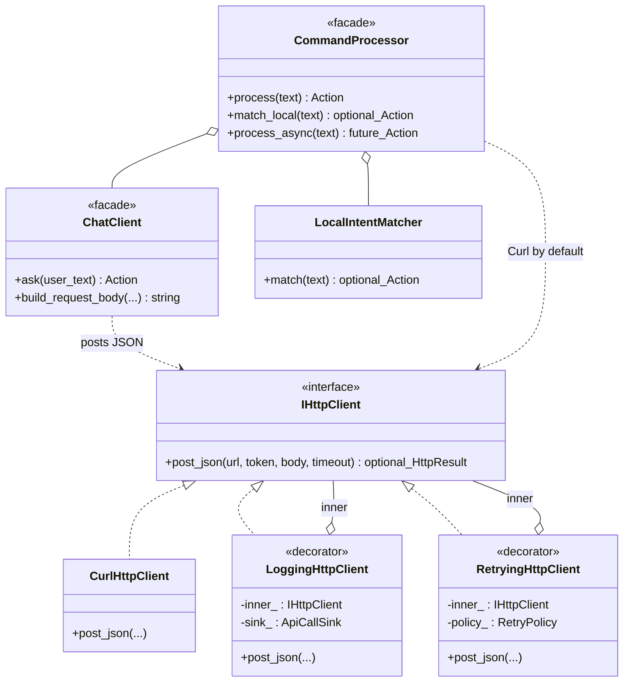
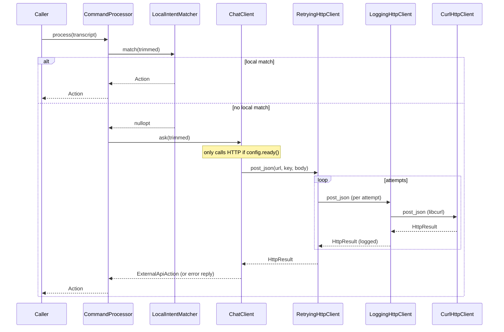

# `ai/`

HTTP transport + command-routing layer. Everything that talks to an external
LLM endpoint goes through this folder, plus the fast regex-based local
matcher that short-circuits the round-trip when the user said something the
robot can answer offline.

## Transport (decorator chain)

```
RetryingHttpClient
   └── LoggingHttpClient        (writes every call into `api_calls`)
        └── CurlHttpClient      (libcurl POST)
```

| File | Purpose |
|---|---|
| `IHttpClient.hpp` | Abstract `post_json(url, bearer, body, timeout)` returning `std::optional<HttpResult>` (nullopt = transport failure). |
| `HttpClient.hpp/cpp` | libcurl-backed `http_post_json` + `CurlHttpClient` adapter. |
| `LoggingHttpClient.hpp/cpp` | Decorator: emits an `ApiCallSink` record (status, latency, bytes, error) per call. Enables the `api_calls` pipeline without plumbing the sink through callers. |
| `RetryingHttpClient.hpp/cpp` | Decorator: exponential backoff on 5xx / 429 / transport failure with a configurable max-attempts budget. Collapses all retries into one terminal log row. |

## Command routing

| File | Purpose |
|---|---|
| `LocalIntentMatcher.hpp/cpp` | Case-insensitive regex matcher. Patterns come from `AppConfig::learning` (lesson/drill phrases) plus built-ins for device / story / music intents. Returns a typed `std::optional<ActionMatch>` so the caller never has to re-run the regex to decide which toggle fired. |
| `ChatClient.hpp/cpp` | OpenAI-compatible chat-completions client. Takes an `IHttpClient&` so tests can inject a canned response. |
| `CommandProcessor.hpp/cpp` | Thin façade: tries `match_local` first, falls back to `ChatClient::ask`. Exposes `process_async` for off-loop chat calls. |
| `OpenAiChatContent.hpp/cpp` | `nlohmann::json` extractor that pulls `choices[0].message.content` out of responses regardless of which OpenAI-compat host produced them. |
| `HttpReplyBuckets.hpp/cpp` | Shared `short_reply_for_status(int)` → spoken-safe one-liner (`"I'm temporarily offline"`, `"temporarily unavailable"`, …). Used by both `ChatClient::ask` error paths and `EnglishTutorProcessor::call_llm_` to keep error replies consistent. |

## Tests

- `tests/test_openai_chat_content.cpp` — JSON extractor.
- `tests/test_local_intent_matcher.cpp` — full regex matrix.
- `tests/test_retrying_http.cpp` — exponential backoff + transient classification.

## Notes

- The whole transport chain is optional at configure time: when `libcurl`
  is not found, a stub `http_post_json` returns a "disabled" marker and
  `voice_detector` still links and runs, just without external AI.
- `LocalIntentMatcher` intentionally owns `thread_local` compiled regex
  objects so the hot path never re-compiles.

See [`../../ARCHITECTURE.md#commandprocessor`](../../ARCHITECTURE.md#commandprocessor)
for the full routing diagram.

## UML

### Class diagram — `IHttpClient` Decorator chain + `CommandProcessor`

The intended decorator stack documented in
[`RetryingHttpClient.hpp`](./RetryingHttpClient.hpp) is
`RetryingHttpClient(LoggingHttpClient(CurlHttpClient))`; this stack is
wired manually in
[`learning/cli/EnglishTutorMain.cpp`](../learning/cli/EnglishTutorMain.cpp).
`CommandProcessor` itself uses a bare `CurlHttpClient` by default. Each
`*Action` builder lives in [`../actions/`](../actions/README.md) and
emits an `Action` struct.



### Sequence diagram — `CommandProcessor::process`

Local intents short-circuit the chat call. When the matcher returns
`nullopt`, `ChatClient` issues an HTTP POST through the wired
`IHttpClient` chain. In `EnglishTutorMain.cpp` that chain is
`RetryingHttpClient -> LoggingHttpClient -> CurlHttpClient`; in the
default `CommandProcessor` constructor it is just `CurlHttpClient`.


