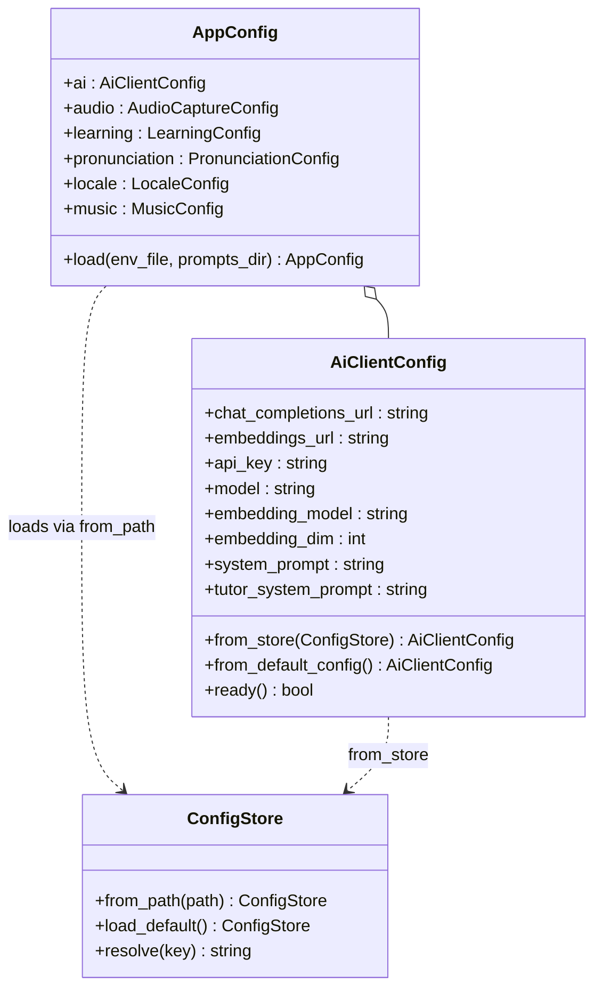

# `config/`

Runtime configuration loader. `ConfigStore` reads `.env/config.env`
(dotenv-style, env vars take precedence), `AppConfig` is the top-level
container held by every subsystem, and [`config/ai/`](./ai/README.md) owns
the OpenAI-compatible HTTP client settings.

## Files

| File | Purpose |
|---|---|
| `ConfigStore.hpp/cpp` | dotenv parser (`KEY=value`, quoted values, comments) + env-var lookup. Process-wide singleton-style access via static helpers. |
| `AppConfig.hpp/cpp` | Top-level config container. Groups `ai`, `audio`, `learning`, `pronunciation`, and `locale` sub-configs; populated once from `ConfigStore` at startup. |

## Environment variables

The full, authoritative list of `HECQUIN_*` / `OPENAI_*` / `GEMINI_*`
variables is in [`../../README.md`](../../README.md). Each sub-config
parses the subset it owns.

## Tests

- `tests/test_config_store.cpp` — dotenv parsing incl. env-var override.

## Notes

- Never cache `ConfigStore` values outside `AppConfig`. Callers read from
  `AppConfig` so we have one well-defined order of precedence.
- Platform-specific paths (model locations, curriculum dir, etc.) are
  resolved against the `HECQUIN_ENV` platform directory — see
  `sound/scripts/dev_project.sh` for the `-D` flags CMake receives.

## UML — class diagram

`ConfigStore::resolve` always prefers a non-empty environment variable
over the value parsed from `.env/config.env`, so callers never check
`getenv` directly. `AppConfig` is the only thing the rest of the
codebase reads at runtime; `AiClientConfig` is its
[`config/ai/`](./ai/README.md) sub-config.

