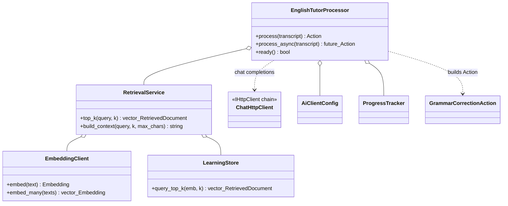
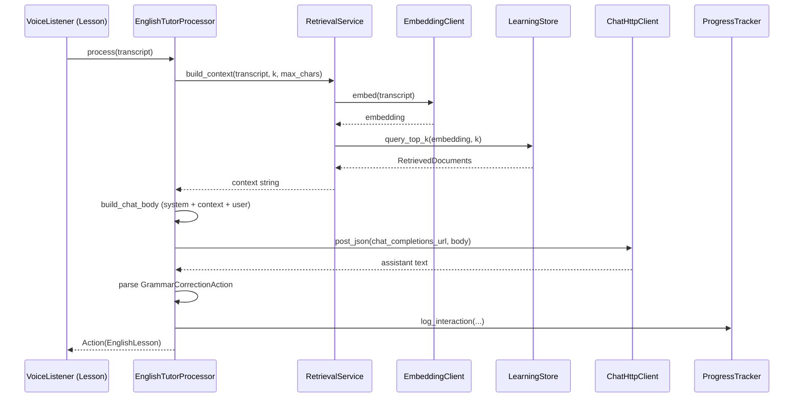

# `learning/`

English tutor + pronunciation drill subsystem. Everything that needs an
embedding, a SQLite row, a per-phoneme score, or a pitch contour lives
under this tree. The top-level files are the coordinators and free
utilities; the heavy lifting is split across five sub-folders.

## Top-level files

| File | Purpose |
|---|---|
| `EmbeddingClient.hpp/cpp` | Gemini / OpenAI-compat embeddings client. Batched `embed_many` + single `embed`. Takes an `IHttpClient&` so tests can inject canned vectors. |
| `Ingestor.hpp/cpp` | Thin coordinator over [`ingest/`](./ingest/README.md). Public API is `run(...) → IngestReport`. |
| `TextChunker.hpp/cpp` | Standalone chunkers: `chunk_text` (prose, budget + overlap, whitespace-preferred) and `chunk_lines` (line-boundary-preserving). Reused by the `ingest/` Strategy implementations and directly by tests. |
| `RetrievalService.hpp/cpp` | Convenience wrapper around `LearningStore::query_top_k` that handles embedding + truncation. |
| `ProgressTracker.hpp/cpp` | Per-user learning log — grammar interactions + pronunciation attempts. Owns the `LearningStore` sessions lifecycle. Writes are namespaced by `LearningApp::current_user_id_` once the listener resolves an `IdentifyUser` intent (defaults to `NULL` for legacy / unidentified rows). |
| `EnglishTutorProcessor.hpp/cpp` | Thin coordinator for the lesson-mode pipeline. Delegates RAG context to [`tutor/TutorContextBuilder`](./tutor/TutorContextBuilder.hpp), JSON body assembly to [`tutor/TutorChatRequest`](./tutor/TutorChatRequest.hpp), and reply parsing to [`tutor/TutorReplyParser`](./tutor/TutorReplyParser.hpp). Public API (`process`, `process_async`) unchanged. |
| `PronunciationDrillProcessor.hpp/cpp` | Thin coordinator for the drill. Orchestrates [`pronunciation/drill/`](./pronunciation/drill/README.md). `load()` itself delegates to two private helpers: `resolve_sentence_pool_()` (file → DB → fallback + shuffle) and `prime_picker_()` (push pool into the picker + warm the G2P cache); the user-facing pick announcement is dispatched through an injectable `announce_cb_` (defaults to `std::cout`) so the class can be unit-tested without capturing stdout. Public API (`load`, `pick_and_announce`, `score`, `available`) is unchanged from pre-refactor. |
| `Vocabulary.hpp/cpp` | Shared `normalise(word)` — lowercase alpha + apostrophe. One source of truth for `ProgressTracker::tokenize` and `LearningStore::touch_vocab`. |

## Sub-folders

- [`cli/`](./cli/README.md) — `LearningApp` bootstrap + the three binary entry points (`english_ingest`, `english_tutor`, `pronunciation_drill`).
- [`tutor/`](./tutor/README.md) — single-responsibility helpers behind `EnglishTutorProcessor` (RAG context builder, chat request body, reply parser).
- [`ingest/`](./ingest/README.md) — file discovery, fingerprinting, chunking strategy, embedding batching, document persistence, CLI progress.
- [`pronunciation/`](./pronunciation/README.md) — wav2vec2 + CTC forced alignment + GOP scoring, plus the [`drill/`](./pronunciation/drill/README.md) collaborators.
- [`prosody/`](./prosody/README.md) — YIN pitch tracker + semitone-DTW intonation scorer.
- [`store/`](./store/README.md) — SQLite-backed persistence (single-connection facade) + per-aggregate detail helpers.

## Tests

- `test_embedding_client_json`, `test_text_chunker`, `test_pronunciation_drill`, `test_english_tutor_processor`, `test_drill_sentence_picker`, `test_drill_reference_audio_lru`, `test_ingest_chunking_strategy`, `test_content_fingerprint`, `test_learning_store`, plus pronunciation / prosody units.
- See [`../../ARCHITECTURE.md#testing`](../../ARCHITECTURE.md#testing) for the full matrix.

## Notes

- Every coordinator is intentionally thin (~100 LOC). Resist growing them
  back — add a new collaborator in the right sub-folder instead.
- The SQLite store is a **single-connection** facade by design. Hold
  transactions through the store helpers, not by passing raw `sqlite3*`
  around.

## UML — English tutor (RAG)

### Class diagram — `EnglishTutorProcessor` + `RetrievalService`

The tutor pipeline is glued together by `EnglishTutorProcessor`. The
HTTP transport is the same `IHttpClient` chain documented in
[`../ai/README.md`](../ai/README.md), wrapped with logging + retry by
[`cli/EnglishTutorMain.cpp`](./cli/EnglishTutorMain.cpp). Drill and
ingest have their own UML in their respective sub-folder READMEs; the
[`store/`](./store/README.md) facade has its own class diagram too.

### Sequence diagram — `EnglishTutorProcessor::process`

Tutor turn: embed the transcript, KNN against `LearningStore`, build a
chat body that includes the retrieved snippets, call the chat HTTP
client, parse a `GrammarCorrectionAction`, and log the interaction.

