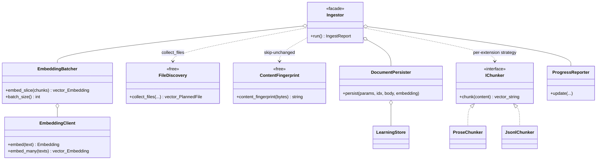
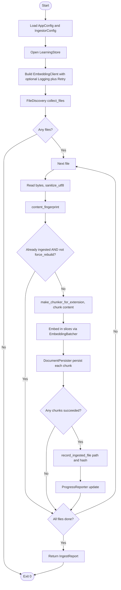

# `learning/ingest/`

The curriculum ingestion pipeline, split by responsibility. `Ingestor`
(one level up) is a thin coordinator that walks files, picks a chunker
Strategy, batches embeddings, persists documents, and prints progress —
each of those steps is one file here.

## Files

| File | Purpose |
|---|---|
| `FileDiscovery.hpp/cpp` | `collect_files(curriculum_dir, custom_dir)` — recursive walk, extension filter, `kind` tagging (`vocabulary` / `grammar` / `readers` / …). |
| `ContentFingerprint.hpp/cpp` | FNV-1a hash over UTF-8-sanitised content. Deterministic, whitespace-sensitive. Used to skip already-ingested files via `LearningStore::is_file_already_ingested`. |
| `ChunkingStrategy.hpp/cpp` | `IChunker` Strategy interface + `make_chunker_for_extension(ext, chunk_chars, overlap)` factory: `jsonl` / `json` → `JsonlChunker`, anything else → `ProseChunker`. |
| `ProseChunker.hpp/cpp` | Character-window chunker with overlap, whitespace-preferred breaks. Delegates to `learning/TextChunker::chunk_text`. |
| `JsonlChunker.hpp/cpp` | Line-oriented chunker. Preserves whole JSON objects — never splits mid-line. Delegates to `learning/TextChunker::chunk_lines`. |
| `EmbeddingBatcher.hpp/cpp` | Wraps `EmbeddingClient::embed_many` with per-chunk single-embed fallback when a batch returns a partial / wrong-size response. |
| `DocumentPersister.hpp/cpp` | Builds `DocumentRecord` metadata JSON + forwards to `LearningStore::upsert_document`. |
| `ProgressReporter.hpp/cpp` | CLI progress lines + ETA: `format_duration`, `begin_plan`, `begin_file`, `skip_*`, `chunk_progress`, `finish_plan`. Knows nothing about the persistence layer. |

## Pipeline (how the coordinator uses these)

```
Ingestor::run(curriculum_dir, custom_dir):
  files = FileDiscovery::collect_files(...)
  ProgressReporter::begin_plan(files.size(), ...)
  for file in files:
    content   = sanitize_utf8(read_file(file))
    hash      = ContentFingerprint::content_fingerprint(content)
    if store.is_file_already_ingested(path, hash) and not rebuild: skip
    chunker   = make_chunker_for_extension(ext, ...)
    chunks    = chunker->chunk(content)
    batches   = EmbeddingBatcher::embed_slice(chunks)
    for (idx, chunk) in enumerate(chunks):
      DocumentPersister::persist(file_params, idx, chunk, batches[idx])
    store.record_ingested_file(path, hash)
  ProgressReporter::finish_plan(report, t_start)
```

## Tests

- `tests/test_ingest_chunking_strategy.cpp` — Strategy dispatch + per-chunker invariants.
- `tests/test_content_fingerprint.cpp` — FNV-1a determinism + sensitivity.

## Notes

- Adding a new content type (e.g. PDF): implement a new `IChunker`, wire
  it into `make_chunker_for_extension`, add one assertion in
  `test_ingest_chunking_strategy.cpp`. Do not touch `Ingestor.cpp`.
- `ProgressReporter` is CLI-only. Do **not** hook it into the logger —
  the `english_ingest` binary reads its output interactively.

## UML

### Class diagram — `Ingestor` facade + `IChunker` Strategy

The `Ingestor` (one level up in [`../README.md`](../README.md))
sequences the small collaborators in this folder; `IChunker` is the
chunking Strategy with `ProseChunker` and `JsonlChunker` implementations
selected by file extension via `make_chunker_for_extension`.



### Activity diagram — `english_ingest` pipeline

Discover -> fingerprint -> (skip if unchanged) -> chunk -> embed in
slices -> persist each chunk -> record file hash on success. Mermaid
has no first-class activity syntax, so this is rendered as a flowchart.


