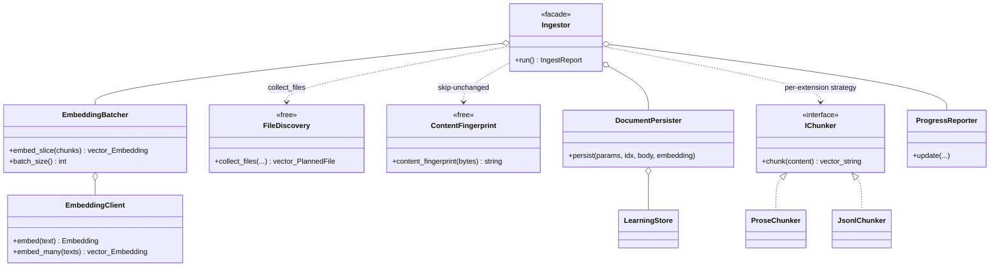
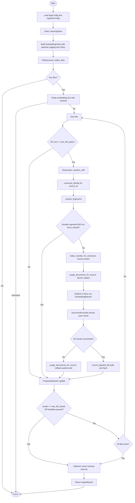

# `learning/ingest/`

The curriculum ingestion pipeline, split by responsibility. `Ingestor`
(one level up) is a thin coordinator that walks files, picks a chunker
Strategy, batches embeddings, persists documents, and prints progress —
each of those steps is one file here.

## Files

| File | Purpose |
|---|---|
| `FileDiscovery.hpp/cpp` | `collect_files(curriculum_dir, custom_dir)` — recursive walk, extension filter, `kind` tagging (`vocabulary` / `grammar` / `readers` / …). |
| `ContentFingerprint.hpp/cpp` | FNV-1a hash over UTF-8-sanitised content. Deterministic, whitespace-sensitive. Used to skip already-ingested files via `LearningStore::is_file_already_ingested`. |
| `ChunkingStrategy.hpp/cpp` | `IChunker` Strategy interface + `make_chunker_for_extension(ext, chunk_chars, overlap)` factory: `jsonl` / `json` → `JsonlChunker`, anything else → `ProseChunker`. |
| `ProseChunker.hpp/cpp` | Character-window chunker with overlap, whitespace-preferred breaks. Delegates to `learning/TextChunker::chunk_text`. |
| `JsonlChunker.hpp/cpp` | Line-oriented chunker. Preserves whole JSON objects — never splits mid-line. Delegates to `learning/TextChunker::chunk_lines`. |
| `EmbeddingBatcher.hpp/cpp` | Wraps `EmbeddingClient::embed_many` with per-chunk single-embed fallback when a batch returns a partial / wrong-size response. |
| `DocumentPersister.hpp/cpp` | Builds `DocumentRecord` metadata JSON + forwards to `LearningStore::upsert_document`. |
| `ProgressReporter.hpp/cpp` | CLI progress lines + ETA: `format_duration`, `begin_plan`, `begin_file`, `skip_*`, `chunk_progress`, `finish_plan`. Knows nothing about the persistence layer. |

## Pipeline (how the coordinator uses these)

```
Ingestor::run(curriculum_dir, custom_dir):
  embed.probe_dim()                                # hard-stop on mismatch
  files = FileDiscovery::collect_files(...)        # auto-tagged by subdir
  ProgressReporter::begin_plan(files.size(), ...)
  for file in files:
    if file.size > IngestorConfig::max_file_bytes: skip
    content   = sanitize_utf8(read_file(file))
    source_id = canonical_identity(file)           # cwd-independent
    hash      = ContentFingerprint::content_fingerprint(content)
    if store.is_file_already_ingested(source_id, hash) and not rebuild: skip
    chunker   = make_chunker_for_extension(ext, ...)
    chunks    = chunker->chunk(content)
    store.purge_documents_for_source(source_id)    # atomic per-file replace
    batches   = EmbeddingBatcher::embed_slice(chunks)
    for (idx, chunk) in enumerate(chunks):
      DocumentPersister::persist(file_params, idx, chunk, batches[idx])
    if every chunk succeeded:
      store.record_ingested_file(source_id, hash)
    else:
      store.purge_documents_for_source(source_id)  # rollback partial write
    if consecutive_failures >= max_fail_streak: abort
    if elapsed >= run_deadline_seconds: abort
  if --prune-missing:
    for src in store.list_document_sources():
      if src not in planned: store.purge_documents_for_source(src) +
                             store.delete_ingested_file(src)
  ProgressReporter::finish_plan(report, t_start)
```

## CLI flags

`english_ingest` understands the following knobs (each is also an
`IngestorConfig` field, so callers wiring the library directly get the
same surface):

| Flag | Default | Purpose |
|---|---|---|
| `--rebuild` | off | Re-embed even files that are already ingested. |
| `--curriculum <dir>` | from `config.env` | Override curriculum corpus root. |
| `--custom <dir>` | from `config.env` | Override custom corpus root. |
| `--chunk-chars N` | 1800 | Target chunk size in characters. |
| `--batch-size N` | 16 | Embeddings packed per HTTP request (1 = no array batching). |
| `--prune-missing` | off | Drop DB rows whose source file is no longer on disk. |
| `--max-fail-streak N` | 50 | Abort after N consecutive failed chunks (0 disables). |
| `--deadline N` | 0 (unbounded) | Wall-clock deadline for the whole run, in seconds. |
| `--max-file-bytes N` | 52428800 (50 MiB) | Skip source files larger than N bytes (0 disables). |
| `--api-log-csv <path>` | off | Append one CSV row per outbound `/embeddings` POST. Env: `HECQUIN_INGEST_API_LOG_CSV`. |
| `--run-summary-csv <path>` | off | Append one CSV row per ingest run. Env: `HECQUIN_INGEST_RUN_SUMMARY_CSV`. |

## Cost log

Embedding requests are billed; the two opt-in CSVs above let you sum
spend without touching the SQLite `api_calls` table. Set either env var
in `sound/.env/config.env` (relative paths anchor at the config dir,
identical to `HECQUIN_LEARNING_DB_PATH`) or pass the matching CLI flag.
Both files are append-only; the header is written once on the first
write and skipped on every subsequent open.

- **Per-call CSV** columns:
  `timestamp_iso8601,provider,endpoint,method,status,latency_ms,request_bytes,response_bytes,ok,error`
- **Per-run CSV** columns:
  `started_iso,duration_seconds,files_scanned,files_skipped,files_ingested,files_pruned,chunks_written,chunks_failed,exit_code`

`request_bytes` is a usable proxy for spend; the OpenAI-compat
`/embeddings` endpoint does not return token counts, so we deliberately
do not synthesise a `cost_usd` column that would silently rot when
provider pricing changes.

## Tests

- `tests/test_ingest_chunking_strategy.cpp` — Strategy dispatch + per-chunker invariants.
- `tests/test_content_fingerprint.cpp` — FNV-1a determinism + sensitivity.
- `tests/test_jsonl_chunker_single_line_json.cpp` — single-line `.json` >
  budget falls back to prose chunking instead of one over-budget chunk.
- `tests/test_embedding_batcher_skips_fallback_on_stable.cpp` — stable
  failures (401/403/400/dim-mismatch) skip the per-chunk fallback.
- `tests/test_ingestor_cwd_independence.cpp` — second run from a different
  cwd hits the unchanged-skip branch.
- `tests/test_ingestor_shrink_cleanup.cpp` — shrinking a file (M → N
  chunks) leaves no orphan rows.
- `tests/test_ingestor_partial_failure_no_mark.cpp` — partial chunk
  failure rolls back and does NOT mark the file as ingested.
- `tests/test_ingestor_prune_missing.cpp` — `--prune-missing` drops
  vanished sources; default keeps them.
- `tests/learning/cli/test_csv_api_call_sink_appends_and_escapes.cpp` —
  per-call CSV header + RFC-4180 quoting for embedded `,`/`"`.
- `tests/learning/cli/test_csv_api_call_sink_header_only_once.cpp` —
  reopening the per-call CSV appends rows without rewriting the header.
- `tests/learning/cli/test_run_summary_csv_appends.cpp` — per-run
  summary CSV writes header once and appends one row per `Ingestor::run()`.

## Notes

- Adding a new content type (e.g. PDF): implement a new `IChunker`, wire
  it into `make_chunker_for_extension`, add one assertion in
  `test_ingest_chunking_strategy.cpp`. Do not touch `Ingestor.cpp`.
- `ProgressReporter` is CLI-only. Do **not** hook it into the logger —
  the `english_ingest` binary reads its output interactively.
- `JsonlChunker` is also routed for `.json`. Real JSONL streams (one
  record per line) are split on newlines; a pretty-printed single-line
  `.json` document larger than `chunk_chars` is detected and routed
  through the prose chunker so the embedding API never sees one giant
  request body.
- `kind_from_dir` matches the first path component **exactly** against
  the canonical kinds (`vocabulary`, `grammar`, `dictionary`, `readers`)
  — anything else falls back to `curriculum` for files under
  `curriculum/`, and `custom` for files directly under `custom/`.
  Subdirectories under `custom/` get the same per-bucket tagging as
  `curriculum/` (so `custom/grammar/foo.txt` is `kind=grammar`).
- Source paths are canonicalised (`fs::weakly_canonical`) before they
  reach the DB, so the same file ingested from different working
  directories — or via `dir/foo` vs `./dir/foo` — hashes to the same
  `documents.source` and `ingested_files.path` row. Combined with
  `AppConfig::load` resolving every relative path against the config
  file's directory, this is what makes `english_ingest` and
  `english_tutor` finally see the same `learning.sqlite` regardless of
  who chdir'd where.

## UML

### Class diagram — `Ingestor` facade + `IChunker` Strategy

The `Ingestor` (one level up in [`../README.md`](../README.md))
sequences the small collaborators in this folder; `IChunker` is the
chunking Strategy with `ProseChunker` and `JsonlChunker` implementations
selected by file extension via `make_chunker_for_extension`.



### Activity diagram — `english_ingest` pipeline

Discover -> fingerprint -> (skip if unchanged) -> chunk -> embed in
slices -> persist each chunk -> record file hash on success. Mermaid
has no first-class activity syntax, so this is rendered as a flowchart.


