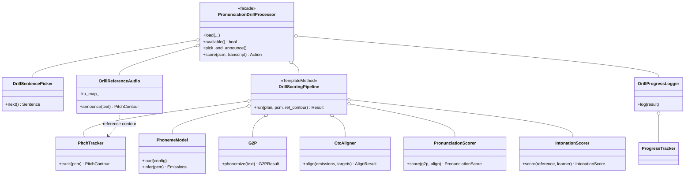
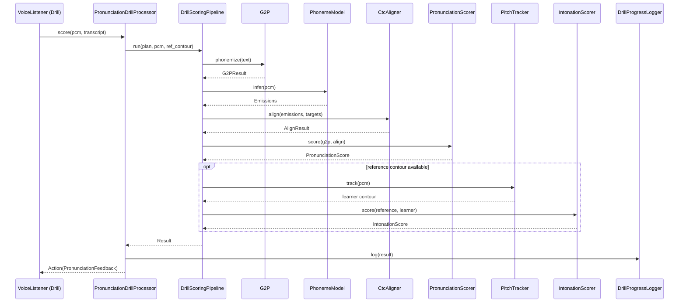
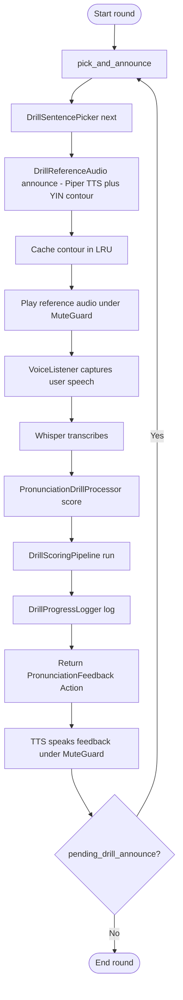

# `learning/pronunciation/drill/`

Drill collaborators. `PronunciationDrillProcessor` (two levels up) is a
thin coordinator that holds one of each of these and exposes the public
API (`load`, `pick_and_announce`, `score`, `available`) unchanged.

## Files

| File | Purpose |
|---|---|
| `DrillSentencePicker.hpp/cpp` | Spaced-repetition picker. Owns the sentence pool + a phoneme → sentence-indices index (built with a supplied `G2P`). Biases draws toward sentences containing the learner's currently-weakest phonemes (from `LearningStore::weakest_phonemes`); falls back to pure round-robin when the store / index is unavailable or `weakness_bias == 0`. |
| `DrillReferenceAudio.hpp/cpp` | Synthesises the reference with Piper, tracks pitch at the Piper-native rate, and **caches** `(PCM, pitch contour, tracker cfg)` in an LRU keyed by sentence text so repeats replay without re-invoking the synthesiser. Test-only hooks (`put_for_test`, `lookup_for_test`, `cache_size_for_test`, `cache_keys_for_test`) let the LRU policy be exercised offline. |
| `DrillScoringPipeline.hpp/cpp` | **Template Method**: fixed outline *plan → align → score → intonation → feedback*, with `PhonemeModel`, `G2P`, `PronunciationScorer`, `IntonationScorer` injected. Tests substitute fakes through `set_phoneme_model_for_test` / `set_g2p_for_test`. |
| `DrillProgressLogger.hpp/cpp` | Builds per-phoneme JSON and writes the attempt into `pronunciation_attempts` + updates `phoneme_mastery` via `ProgressTracker` / `LearningStore`. |

## How the coordinator uses them

```
PronunciationDrillProcessor::pick_and_announce():
  text      = SentencePicker.next()
  contour   = ReferenceAudio.announce(text)      ← LRU-cached
  state.reference = { text, contour }

PronunciationDrillProcessor::score(pcm, transcript):
  score     = ScoringPipeline.run(state.reference, pcm, transcript)
  ProgressLogger.record(score, state.session_id)
  return PronunciationFeedbackAction(score)
```

## Tests

- `tests/test_pronunciation_drill.cpp` — end-to-end with fake emissions + injected plan.
- `tests/test_drill_sentence_picker.cpp` — round-robin + `load()` cursor reset.
- `tests/test_drill_reference_audio_lru.cpp` — LRU insert / lookup / eviction / MRU bump / `cache_size == 0` disable.

## Notes

- The LRU is keyed by exact text. If a caller needs normalisation, do it
  before calling `announce(...)` — the cache key is deliberately strict.
- Do not make `DrillScoringPipeline` aware of `LearningStore`. The
  pipeline returns a `DrillScore`; persistence lives in
  `DrillProgressLogger`.

## UML

### Class diagram — `PronunciationDrillProcessor` facade + `DrillScoringPipeline` Template Method

`DrillScoringPipeline::run` is the shared scoring skeleton (phonemize ->
infer -> align -> score -> intonation); collaborators are pluggable for
tests via the `set_*_for_test` hooks.



### Sequence diagram — `PronunciationDrillProcessor::score`

The facade delegates to `DrillScoringPipeline::run`, which executes the
fixed Template Method skeleton (G2P, phoneme model inference, CTC
alignment, GOP scoring, optional intonation against the cached
reference contour), then logs progress.



### Activity diagram — drill round

Pick & announce -> capture user speech -> Whisper transcribes -> score
-> log -> feedback -> next sentence. The `pending_drill_announce_` flag
on `VoiceListener` triggers the next `pick_and_announce` after the TTS
feedback finishes.


