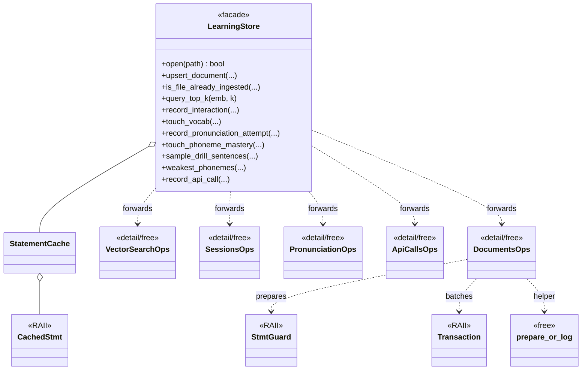

# `learning/store/`

SQLite-backed persistence for the learning module. `LearningStore` is a
**single-connection facade**: one `sqlite3*`, one `StatementCache`, many
per-aggregate helpers. Every public method is a thin forwarder to a free
function in [`detail/`](./detail/README.md) that takes `(sqlite3*,
StatementCache&, …)` as explicit arguments, which keeps the
single-connection invariant visible in every call site and gives tests a
clean seam.

## Files

| File | Purpose |
|---|---|
| `LearningStore.hpp` | Public facade (one class). |
| `LearningStore.cpp` | Lifecycle + metadata (open / close, kv, `StatementCache`). |
| `LearningStoreMigrations.cpp` | All DDL. Schema v3 — documents, ingested_files, sessions, interactions, vocab, pronunciation_attempts, phoneme_mastery, api_calls, pipeline_events, drill pool, vec0 virtual table. |
| `LearningStoreDocuments.cpp` | Forwards to [`detail::DocumentsOps`](./detail/README.md). |
| `LearningStoreVectorSearch.cpp` | Forwards to `detail::VectorSearchOps` (vec0 path + BLOB brute-force fallback). |
| `LearningStoreSessions.cpp` | Forwards to `detail::SessionsOps`. |
| `LearningStorePronunciation.cpp` | Forwards to `detail::PronunciationOps`. |
| `LearningStoreApiCalls.cpp` | Forwards to `detail::ApiCallsOps` (writes api_calls + pipeline_events). |

## Sub-folders

- [`detail/`](./detail/README.md) — per-aggregate free-function headers implementing the logic.
- [`internal/`](./internal/README.md) — private RAII helpers (`StmtGuard`, `Transaction`, `prepare_or_log`, `bind_*`, `StatementCache`).

## Schema

Full v3 schema + column-by-column meaning is in
[`../../../ARCHITECTURE.md#sqlite-schema-learning-db-v3`](../../../ARCHITECTURE.md#sqlite-schema-learning-db-v3).

## Tests

- `tests/test_learning_store.cpp` — open + migration + document upsert + vector retrieval round-trip.

## Notes

- Never open a second connection. All concurrent access goes through the
  facade; if you need an async write, queue it instead of opening another
  `sqlite3*`.
- `StatementCache` memoises prepared statements by SQL text, so hot paths
  (e.g. `query_top_k`) never re-compile.
- When adding a new aggregate, create a new `LearningStore<Name>.cpp`
  forwarder + `detail/<Name>Ops.hpp/.cpp` pair — keep the per-aggregate
  cut. Don't grow `LearningStore.cpp`.

## UML — class diagram

`LearningStore` is the public facade; per-aggregate logic lives as free
functions in [`detail/`](./detail/README.md) and shares RAII / utility
primitives from [`internal/`](./internal/README.md). Forwarders in
`LearningStore<Name>.cpp` thread `(sqlite3*, StatementCache&, …)` into
the `detail` ops so the single-connection invariant stays visible at
every call site.

