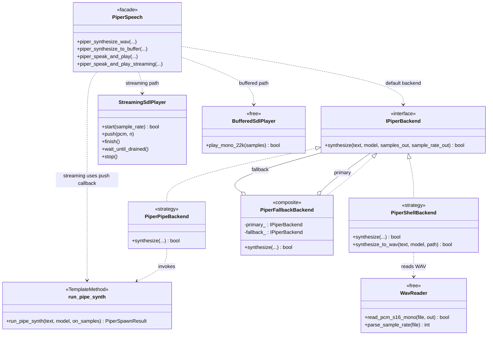
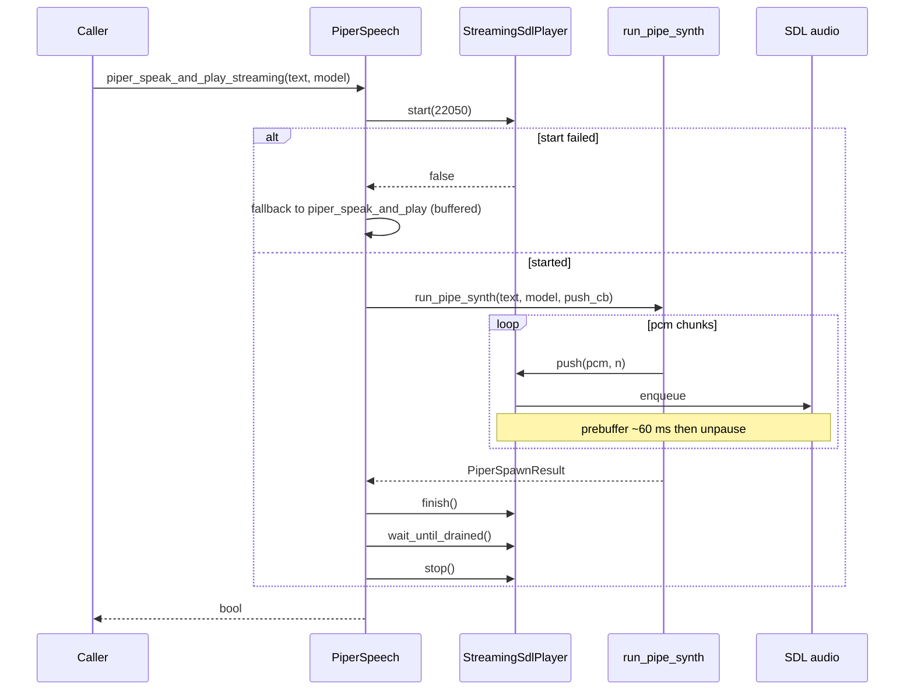
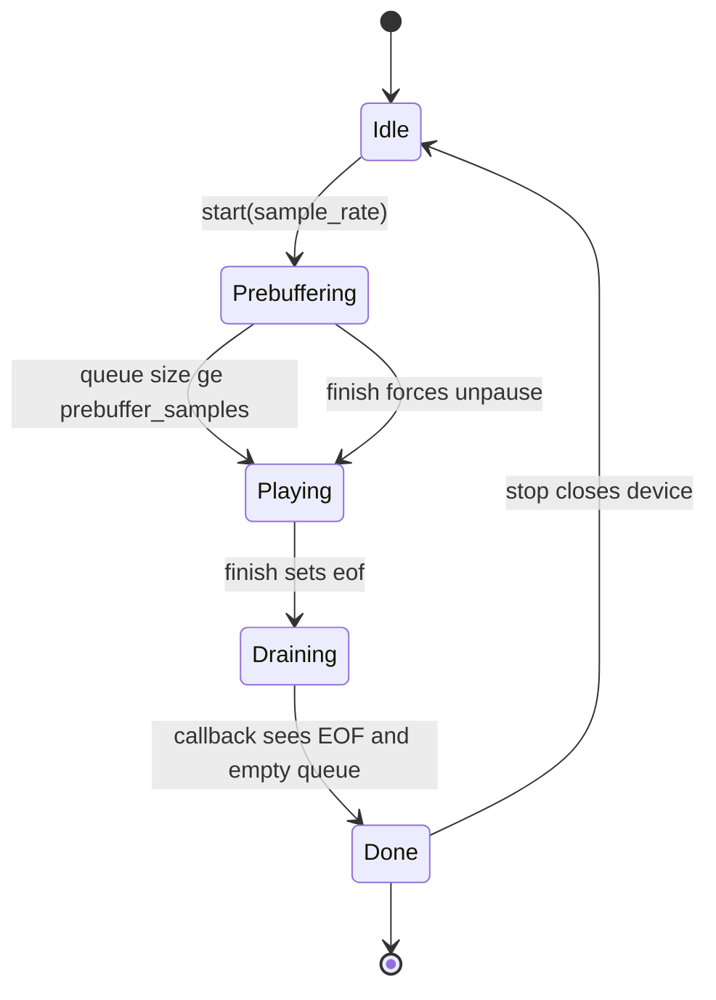

# `tts/`

Piper TTS facade + the split collaborators under `backend/`, `playback/`,
`runtime/`, and `wav/`. The public C-style API (`piper_speak_and_play`,
`piper_speak_and_play_streaming`, `piper_synthesize_to_buffer`) stays
intact so every caller is unchanged; implementation details now live in
single-responsibility files.

## Files

| File | Purpose |
|---|---|
| `PiperSpeech.hpp/cpp` | Public facade. Holds the default `IPiperBackend` (pipe → shell fallback) and forwards the speak-and-play entry points to `PlayPipeline`. Keeps the legacy free-function API. |
| `PlayPipeline.hpp/cpp` | Implementation of `piper_speak_and_play` and `piper_speak_and_play_streaming` — buffered vs streaming SDL playback orchestrated against the `IPiperBackend`. Extracted out of `PiperSpeech.cpp` so the facade stays a true facade. |

## Sub-folders

- [`backend/`](./backend/README.md) — Strategy interface + pipe / shell / composite-fallback implementations and the `PiperSpawn` Template Method.
- [`playback/`](./playback/README.md) — SDL audio device lifecycle + pre-buffered and streaming players.
- [`runtime/`](./runtime/README.md) — macOS `DYLD_FALLBACK_LIBRARY_PATH` configuration.
- [`wav/`](./wav/README.md) — Generic 44-byte WAV reader (no Piper dependency).

## Who calls what

- `voice/TtsResponsePlayer` — `piper_speak_and_play_streaming` for assistant / tutor replies.
- `learning/pronunciation/drill/DrillReferenceAudio` — `piper_synthesize_to_buffer` (needs raw PCM to compute pitch contour) + `sdl_play_s16_mono_22k`.
- `cli/TextToSpeech.cpp` — `piper_speak_and_play` (plus WAV-write path).

## Tests

- `tests/tts/test_piper_backend_fallback.cpp` — Strategy composition with stubbed backends.
- `tests/tts/test_pcm_ring_queue.cpp` — `std::condition_variable`-backed drain signalling, EOF behaviour, multi-producer safety.

## Notes

- Keep the facade's C-style API stable; callers outside this folder must
  never include `tts/backend/*` directly.
- The streaming player exists so long replies start playing as soon as
  the first chunk arrives. Do not "fix" it to buffer — that regresses
  perceived latency by ~600 ms on typical tutor replies.

## UML

### Class diagram — `IPiperBackend` Strategy + `run_pipe_synth` Template Method

`PiperSpeech.hpp` exposes a flat C-style facade; the real polymorphism
lives in [`backend/IPiperBackend.hpp`](./backend/IPiperBackend.hpp) with
a composite `PiperFallbackBackend` wrapping pipe and shell strategies.
`run_pipe_synth` is a free function that acts as the shared
template-method skeleton (process spawn, stdin write, stdout read loop)
parameterized by an `on_samples` callback.

### Sequence diagram — `piper_speak_and_play_streaming`

`StreamingSdlPlayer` is started, `run_pipe_synth` spawns Piper and pipes
int16 chunks straight into the player via the `push` callback; a ~60 ms
prebuffer gates initial playback. On a failed device start or crashed
Piper process the call falls back to the buffered path.

### State diagram — `StreamingSdlPlayer`

Tracks the `started_`, `eof_`, and `done_` flags around the SDL
callback. The device stays paused until prebuffer fills or `finish()`
forces playback; `done_` is set by the callback once EOF is reached and
the queue drains.

