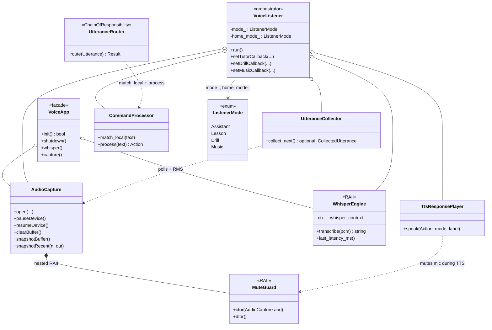
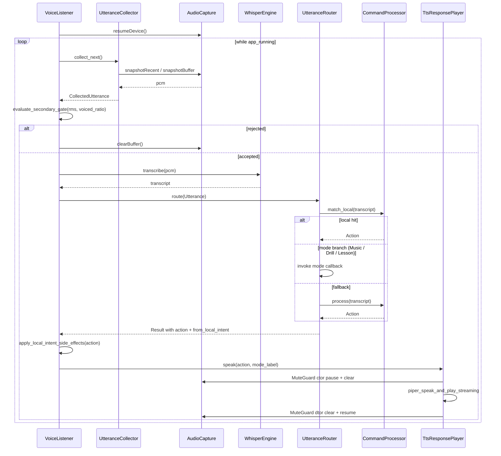
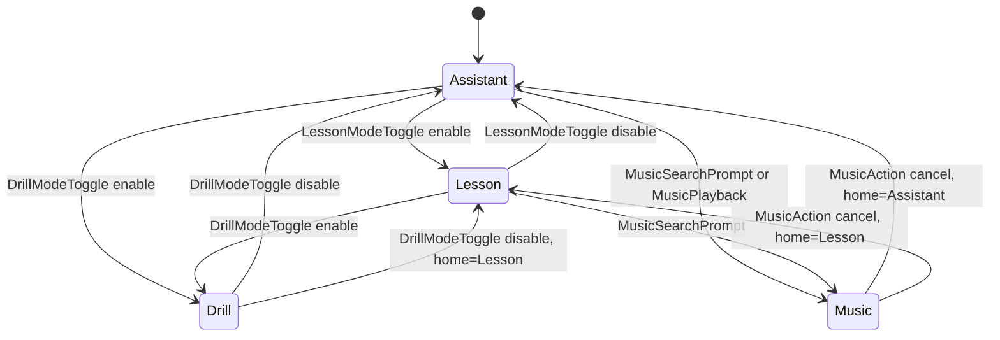
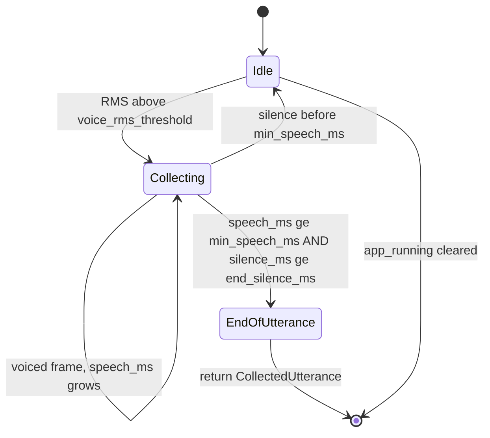

# `voice/`

Microphone capture, VAD, Whisper wrapper, and the listener orchestrator.
`VoiceListener` is a thin coordinator — most responsibilities live in
single-purpose collaborators under this same folder.

## Files

| File | Purpose |
|---|---|
| `AudioCapture.hpp/cpp` | SDL2 microphone capture: ring buffer, `snapshotRecent` (zero-alloc tail copy for VAD), `snapshotBuffer` (full copy on utterance close), `MuteGuard` RAII pause/resume wrapper used during TTS. |
| `AudioCaptureConfig.hpp` | POD config (no SDL include) so the rest of the codebase can reason about sample rate / channels without pulling in SDL. |
| `WhisperEngine.hpp/cpp` | RAII wrapper around `whisper_context`. Env-driven `WhisperConfig` (language / threads / beam / no-speech / min-alnum / suppress-segs). Three-layer noise + hallucination filter on decoder output. |
| `VoiceListener.hpp/cpp` | Coordinator: poll loop + `ListenerMode` state machine + `PipelineEventSink` wiring. Delegates to the four collaborators below. |
| `UtteranceCollector.hpp/cpp` | Owns the 50 ms loop, primary VAD counters, collection timers. Emits a `CollectedUtterance { pcm, stats }` when silence closes. |
| `SecondaryVadGate.hpp/cpp` | Pure `evaluate_secondary_gate(samples, voiced, total, cfg)` → accept / reject with reason. No I/O, trivially testable. |
| `TtsResponsePlayer.hpp/cpp` | TTS sanitisation regex set + `MuteGuard` wrap + Piper playback call. Removes Piper and regex from the listener. |
| `UtteranceRouter.hpp/cpp` | Chain of Responsibility: local intents → drill callback → tutor callback → `CommandProcessor::process` fallback. |
| `VoiceApp.hpp/cpp` | Shared bootstrap for voice executables (`config` → `AudioCapture` → `WhisperEngine` → `VoiceListener`). |
| `VoiceDetector.cpp` | Entry point for the `voice_detector` binary. |

## Listen loop (high level)

```
every 50 ms:
  UtteranceCollector.tick() → maybe CollectedUtterance
  on close:
    decision = SecondaryVadGate.evaluate(...)
    if not decision.accepted: skip, emit pipeline_event
    else:
      transcript = WhisperEngine.transcribe(samples)
      result     = UtteranceRouter.route({transcript, pcm})
      TtsResponsePlayer.speak(result.action.reply)
      update ListenerMode from result
```

Full pseudocode + the `VoiceListenerConfig` table is in
[`../../ARCHITECTURE.md#voicelistener`](../../ARCHITECTURE.md#voicelistener).

## Tests

- `tests/test_voice_listener_vad.cpp` — secondary VAD gate reasons.
- `tests/test_utterance_router.cpp` — Chain of Responsibility ordering.

## Notes

- Mic echo is suppressed by the `MuteGuard` RAII wrapper, not by
  scattered `pauseDevice()` / `resumeDevice()` calls. Use the guard.
- Whisper noise / hallucination filters live inside `WhisperEngine`, not
  in callers — `transcribe()` returns an empty string when any gate trips.

## UML

### Class diagram — `VoiceListener` orchestrator + `UtteranceRouter` Chain of Responsibility + RAII guards

`VoiceListener` glues mic capture, VAD, Whisper, the router, and the TTS
player; `MuteGuard` and `WhisperEngine` are the RAII helpers that keep
the mic and the `whisper_context` lifetime honest.



### Sequence diagram — `VoiceListener::run` loop

One iteration of the listener loop: collect a candidate utterance, run
the secondary VAD gate, transcribe, route to an `Action`, apply side
effects (mode toggles, pending drill announce), and play the TTS reply
with the mic muted via `MuteGuard`. The router's branching reflects the
implementation in
[`UtteranceRouter.cpp`](./UtteranceRouter.cpp).



### State diagram — `ListenerMode`

`VoiceListener::apply_local_intent_side_effects_` mutates `mode_` in
response to selected `ActionKind` values; `home_mode_` controls where
`Music` returns to. There is no first-class FSM type — the diagram
models the observable transitions.



### State diagram — `UtteranceCollector`

Inside `UtteranceCollector::collect_next` an implicit boolean
`collecting` plus the trailing-RMS window form a small FSM that emits
a `CollectedUtterance` once the min-speech and end-silence thresholds
are met.


