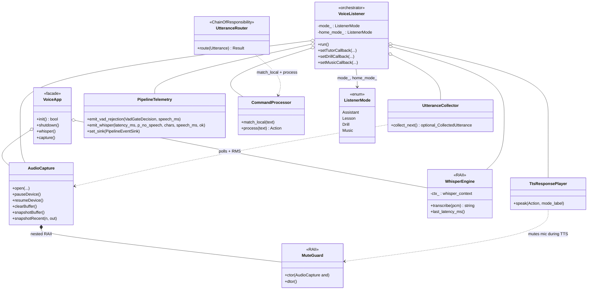
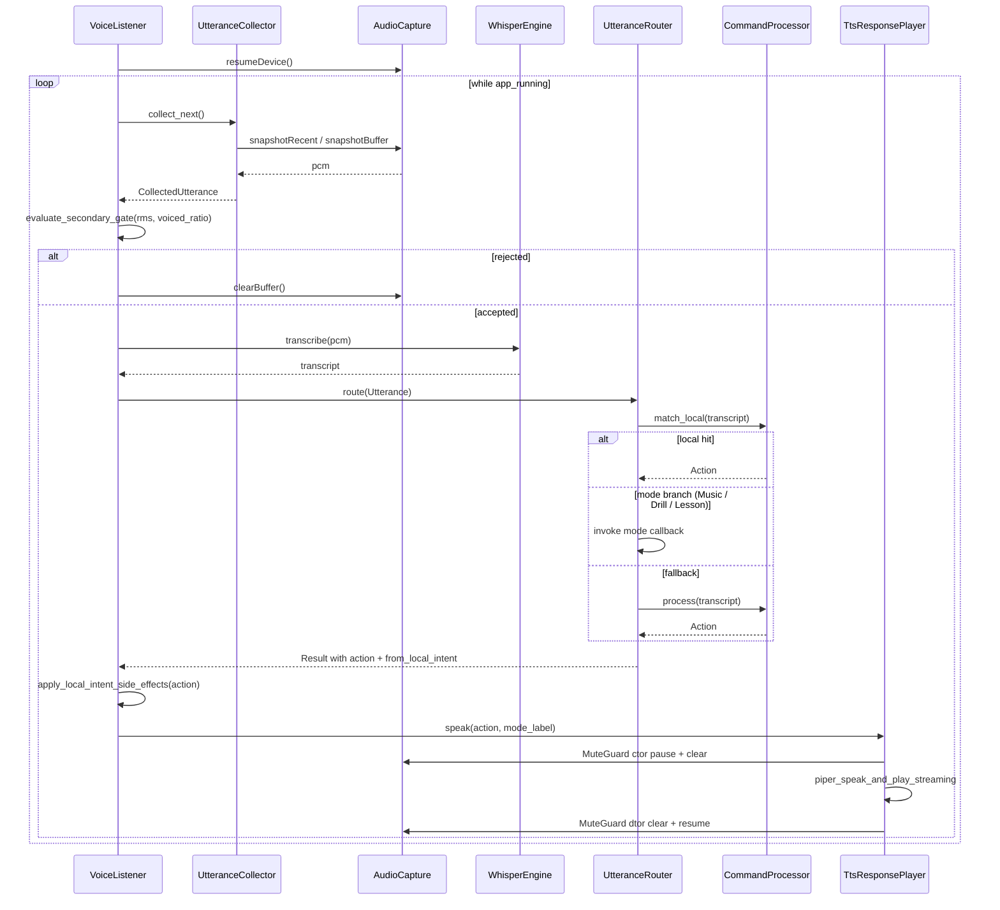
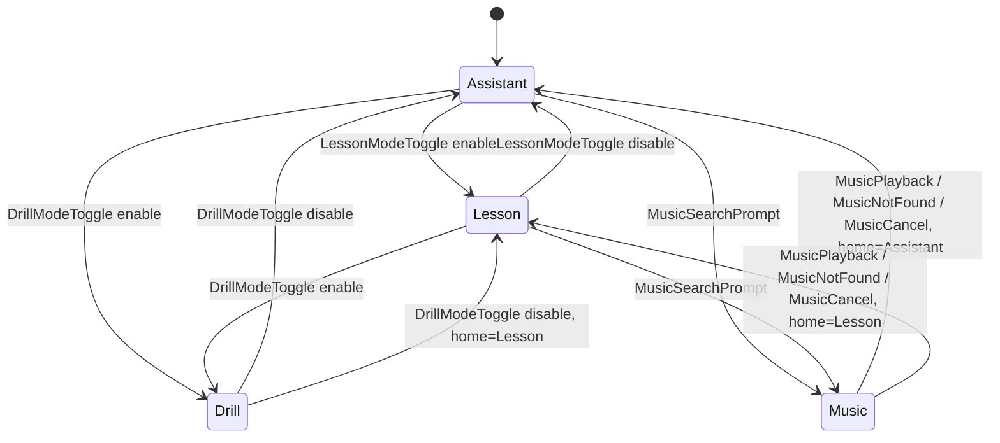
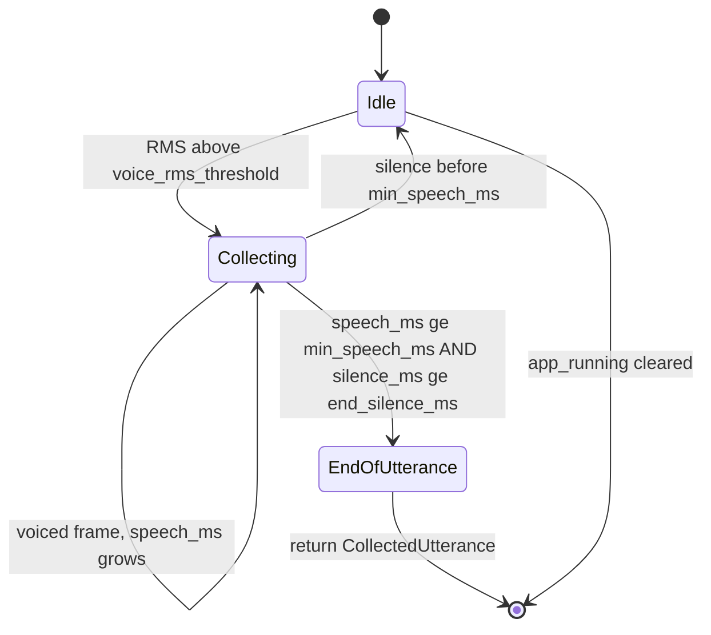

# `voice/`

Microphone capture, VAD, Whisper wrapper, and the listener orchestrator.
`VoiceListener` is a thin coordinator — most responsibilities live in
single-purpose collaborators under this same folder.

## Files

| File | Purpose |
|---|---|
| `AudioCapture.hpp/cpp` | SDL2 microphone capture: ring buffer, `snapshotRecent` (zero-alloc tail copy for VAD), `snapshotBuffer` (full copy on utterance close), `MuteGuard` RAII pause/resume wrapper used during TTS. |
| `AudioCaptureConfig.hpp` | POD config (no SDL include) so the rest of the codebase can reason about sample rate / channels without pulling in SDL. |
| `WhisperEngine.hpp/cpp` | RAII wrapper around `whisper_context`. Env-driven `WhisperConfig` (language / threads / beam / no-speech / min-alnum / suppress-segs). Inference + segment join only — gates live in `WhisperPostFilter`. `transcribe()` is a thin orchestrator that delegates parameter assembly to `build_wparams(WhisperConfig)` and segment iteration / no-speech tracking to `collect_segments(ctx, WhisperConfig)`. |
| `VoiceListenerConfig.hpp/cpp` | POD `VoiceListenerConfig` + `apply_env_overrides()` (lifted out of `VoiceListener.hpp`/`.cpp`). Lets a future config consumer pull just the listener's tuning surface without compiling the whole listener header. |
| `PipelineEvent.hpp` | `PipelineEvent` struct + `PipelineEventSink` typedef (lifted out of `VoiceListener.hpp`). Telemetry consumers can include this without the rest of the listener machinery. |
| `WhisperPostFilter.hpp/cpp` | Pure `filter(joined_text, worst_no_speech_prob, WhisperConfig) → optional<string>`. Strips bracketed / parenthetical non-speech annotations, enforces `min_alnum_chars`, applies the `no_speech_prob_max` gate. Unit-tested without a GGML model. |
| `ListenerMode.hpp` | Tiny header that owns the `ListenerMode { Assistant, Lesson, Drill, Music }` enum. Lives on its own so `ActionSideEffectRegistry` and `VoiceListener` can both include it without circular deps. |
| `VoiceListener.hpp/cpp` | Coordinator: poll loop + `ListenerMode` state machine + `PipelineEventSink` wiring. Delegates to the collaborators below. `apply_local_intent_side_effects_` is now a 10-line dispatch over `ActionSideEffectRegistry::descriptor_for`. |
| `ActionSideEffectRegistry.hpp/cpp` | Static `ActionKind → {ModeChange, ListenerMode target, music_hook, sets_pending_drill}` table. Adding a new music / lesson intent is a one-row extension instead of an 8-case `switch`. |
| `MusicWiring.hpp/cpp` | `install_music_wiring(VoiceListener&, MusicConfig) → MusicWiring` builds a `MusicProvider` via `MusicFactory`, wraps it in a `MusicSession`, and registers all four mid-song callbacks (handle / abort / pause / resume). Replaces the 15-line copy that used to live verbatim in every voice main. |
| `UtteranceCollector.hpp/cpp` | Owns the 50 ms loop, primary VAD counters, collection timers, and the adaptive noise-floor wiring (calibration + hysteresis). `collect_next()` is now a thin loop over `poll_tick_(...)` which packages each tick's work — VAD probe, floor update, debug log, advance — into a `TickResult { Continue, EmitUtterance }`. Snapshots the buffer only when the result is `EmitUtterance`. |
| `MusicSideEffects.hpp/cpp` | Tiny façade that owns the abort / pause / resume callbacks plus a non-owning `UtteranceCollector*` and routes the four music intents (`MusicPlayback` / `MusicNotFound` / `MusicCancel` / `MusicPause` / `MusicResume`) without leaking music plumbing into the listener's main switch. The repeating `(if collector_) ... (if barge_) ...` shape collapses into a private `mark_external_audio_(bool)` helper so each `on_*` callback is one or two lines. |
| `NoiseFloorTracker.hpp/cpp` | Pure ambient-RMS tracker: median-based startup calibration + EMA over idle frames. Drives the adaptive thresholds the collector and secondary gate consume. No I/O, trivially testable. |
| `SecondaryVadGate.hpp/cpp` | Pure `evaluate_secondary_gate(...)` plus a convenience `evaluate_for_utterance(CollectedUtterance, ...)` that derives `effective_frames` and the utterance mean RMS. No I/O, trivially testable. |
| `TtsResponsePlayer.hpp/cpp` | TTS sanitisation regex set + Piper playback call. The two distinct lifecycles — `MuteGuard`-wrapped legacy path vs live-mic barge-in path — live in `speak_with_muted_mic_` / `speak_with_barge_in_`; `speak()` is a thin Strategy dispatcher (sanitise + label-print, then route on `barge_in_live_mic`). |
| `UtteranceRouter.hpp/cpp` | Chain of Responsibility: local intents → drill callback → tutor callback → `CommandProcessor::process` fallback. |
| `PipelineTelemetry.hpp/cpp` | Owns the optional `PipelineEventSink` and the JSON-attribute formatting for every per-stage event the listener emits (`vad_gate`, `whisper`). Centralises the schema. |
| `VoiceApp.hpp/cpp` | Shared bootstrap for voice executables (`config` → `AudioCapture` → `WhisperEngine` → `VoiceListener`). |
| `VoiceDetector.cpp` | Entry point for the `voice_detector` binary. |

`VoiceListenerConfig` and `WhisperConfig` read their `HECQUIN_*` env-var
overrides through the shared header-only helper at
[`../common/EnvParse.hpp`](../common/EnvParse.hpp) (`hecquin::common::env`).

## Listen loop (high level)

```
every 50 ms:
  UtteranceCollector.tick() → maybe CollectedUtterance
  on close:
    decision = SecondaryVadGate.evaluate(...)
    if not decision.accepted: skip, emit pipeline_event
    else:
      transcript = WhisperEngine.transcribe(samples)
      result     = UtteranceRouter.route({transcript, pcm})
      TtsResponsePlayer.speak(result.action.reply)
      update ListenerMode from result
```

Full pseudocode + the `VoiceListenerConfig` table is in
[`../../ARCHITECTURE.md#voicelistener`](../../ARCHITECTURE.md#voicelistener).

## Tests

- `tests/voice/test_voice_listener_vad.cpp` — secondary VAD gate reasons.
- `tests/voice/test_noise_floor_tracker.cpp` — calibration median, EMA convergence, speech rejection, clamps.
- `tests/voice/test_music_side_effects.cpp` — listener-side music callback dispatch with no SDL / Whisper.
- `tests/voice/test_whisper_post_filter.cpp` — annotation strip, min-alnum, no-speech probability gate. No GGML.
- `tests/voice/test_utterance_router.cpp` — Chain of Responsibility ordering.

## Adaptive VAD

`UtteranceCollector` measures the ambient RMS noise floor at startup
(median of the first ~1 s of idle frames) and continuously refines it
with an EMA over later idle frames.  All three RMS thresholds are then
derived from the floor `N`:

| Threshold | Formula | Multiplier env |
|---|---|---|
| Start (enter `Recording`) | `clamp(k_start * N)` | `HECQUIN_VAD_K_START` (default `3.0`) |
| Continue (stay in `Recording`) | `k_continue * start` | `HECQUIN_VAD_K_CONTINUE` (default `0.6`) |
| Secondary gate `min_utterance_rms` | `clamp(k_utt * N)` | `HECQUIN_VAD_K_UTT` (default `2.0`) |

The continue threshold is intentionally lower than the start threshold
(hysteresis): once an utterance has begun, quiet syllables and breaths
shouldn't end it prematurely.

### Boot-time handshake

Two safeguards keep the very first poll cycle from sabotaging the run:

1. `UtteranceCollector` refuses to start a new utterance while the
   calibration window is open, so mic warm-up noise can't false-trigger
   `🔴 Recording...` before the median floor is even available — and
   the calibration samples stay speech-free.
2. When calibration finishes, the collector prints a one-shot
   `🎯 Calibrated (floor=… start=… cont=… utt=…)` line.  That handshake
   is the user's signal that it's safe to speak; before it appears,
   `auto_calibrate` is still measuring the room.

If `auto_calibrate` is off, the gate is open immediately and the static
banner just says `Speak anytime!`.

### Safety net

`max_utterance_ms` (default 15 000 ms, env `HECQUIN_VAD_MAX_UTTERANCE_MS`,
`0` disables) force-closes a recording when speech_ms hits the cap even
if the silence timer never fires.  The collector emits a distinct
`⏹ Recording complete (max duration … ms reached)` line so the cause is
obvious — typically the continue threshold is chasing ambient noise
because the floor calibrated too low; raise `adaptive_min_start_thr`
(env `HECQUIN_VAD_MIN_START_THR`, default `0.005`) until the
hysteresis gap clears the room's noise peaks.

### Escape hatches

- `HECQUIN_VAD_AUTO=0` — disable auto-tuning entirely; use static
  `voice_rms_threshold` / `min_utterance_rms`.
- `HECQUIN_VAD_VOICE_RMS_THRESHOLD=…` / `HECQUIN_VAD_MIN_UTTERANCE_RMS=…`
  — pin a single field; the other(s) keep auto-tuning.
- `HECQUIN_VAD_MIN_START_THR=…` — raise the lower clamp on the
  start threshold (and therefore on the derived continue threshold)
  for noisy rooms / hot mics.
- `HECQUIN_VAD_MAX_UTTERANCE_MS=…` — change or disable the safety
  net.
- `HECQUIN_VAD_DEBUG=1` — log live floor + thresholds once per second
  while idle (`[vad] floor=… start=… cont=… utt=… rms=…`).

## Notes

- Mic echo is suppressed by the `MuteGuard` RAII wrapper, not by
  scattered `pauseDevice()` / `resumeDevice()` calls. Use the guard.
- Whisper noise / hallucination filters live inside `WhisperEngine`, not
  in callers — `transcribe()` returns an empty string when any gate trips.

## UML

### Class diagram — `VoiceListener` orchestrator + `UtteranceRouter` Chain of Responsibility + RAII guards

`VoiceListener` glues mic capture, VAD, Whisper, the router, and the TTS
player; `MuteGuard` and `WhisperEngine` are the RAII helpers that keep
the mic and the `whisper_context` lifetime honest.



### Sequence diagram — `VoiceListener::run` loop

One iteration of the listener loop: collect a candidate utterance, run
the secondary VAD gate, transcribe, route to an `Action`, apply side
effects (mode toggles, pending drill announce), and play the TTS reply
with the mic muted via `MuteGuard`. The router's branching reflects the
implementation in
[`UtteranceRouter.cpp`](./UtteranceRouter.cpp).



### State diagram — `ListenerMode`

`VoiceListener::apply_local_intent_side_effects_` mutates `mode_` in
response to selected `ActionKind` values; `home_mode_` controls where
`Music` returns to. There is no first-class FSM type — the diagram
models the observable transitions.



### State diagram — `UtteranceCollector`

Inside `UtteranceCollector::collect_next` an implicit boolean
`collecting` plus the trailing-RMS window form a small FSM that emits
a `CollectedUtterance` once the min-speech and end-silence thresholds
are met.


