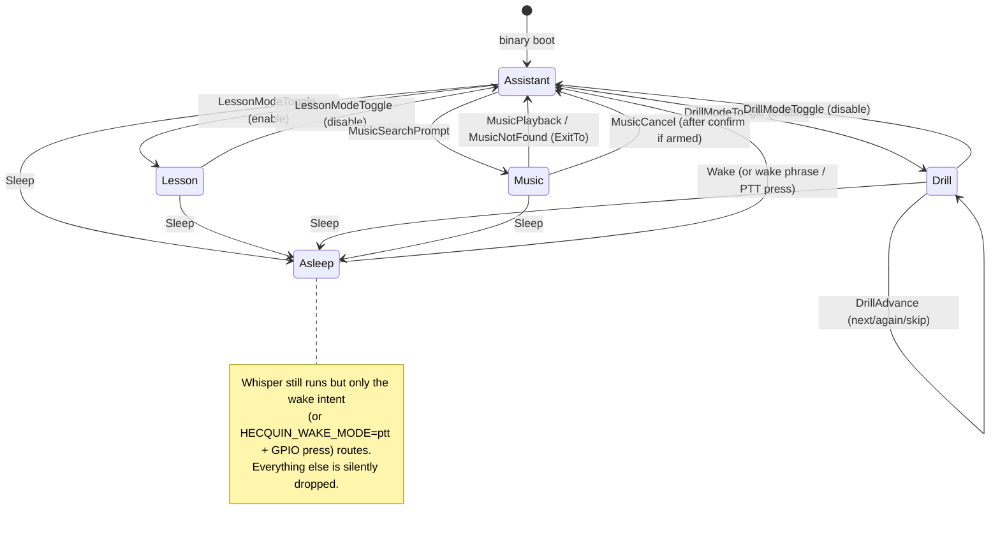
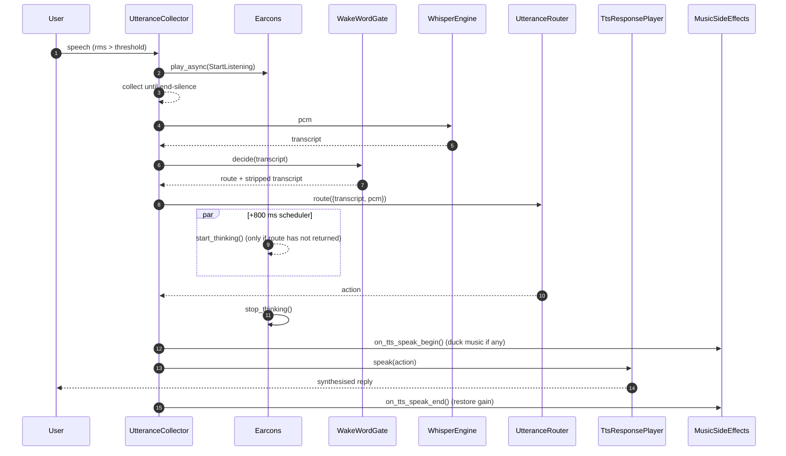
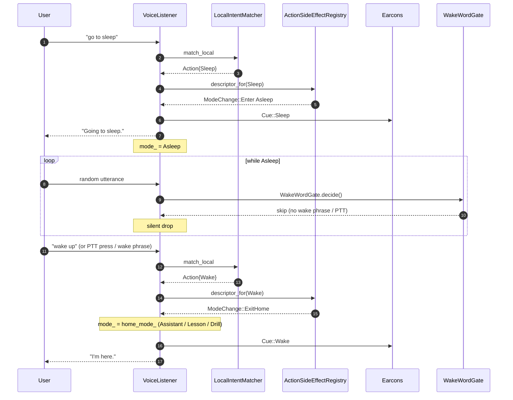
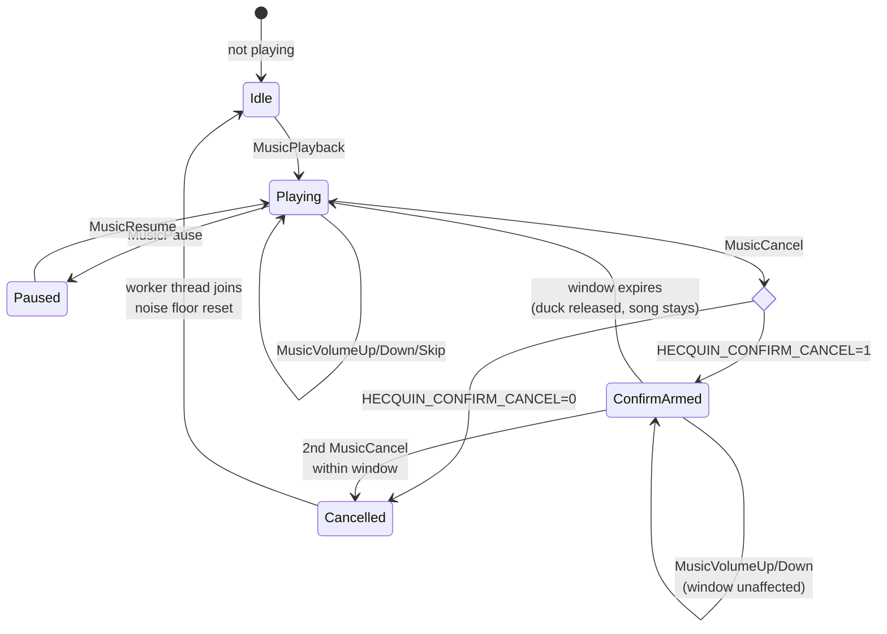
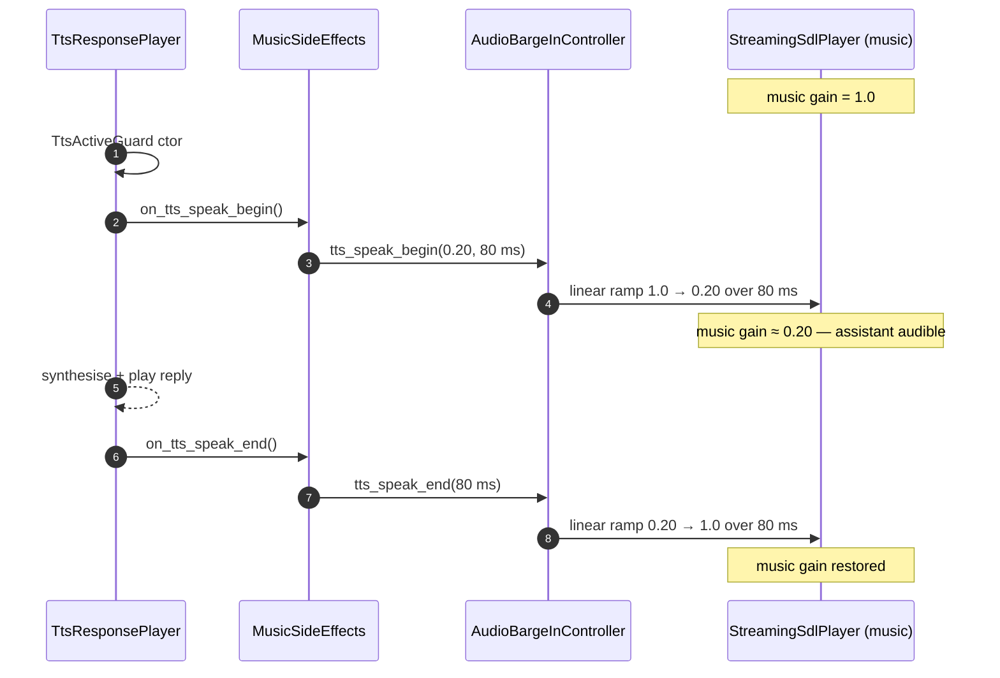
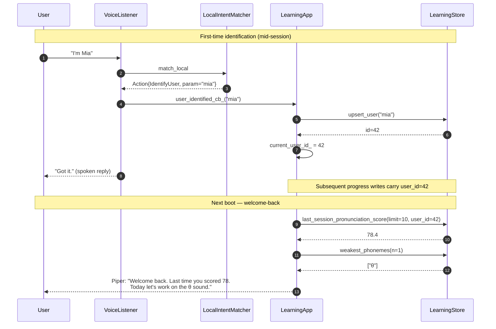

# UX diagrams (Mermaid)

Companion to [`UX_FLOW.md`](../UX_FLOW.md).  
All **state machines** and **UX-focused sequences** for the voice layer live here so the main doc stays scannable.
For **boot**, **full voice-turn choreography**, **TTS barge-in**, and **music session** flows across modules, see [`SEQUENCE_DIAGRAMS.md`](./SEQUENCE_DIAGRAMS.md).

---

## 5. Diagrams

### 5.1 Mode state machine (with `Asleep`)



### 5.2 Per-utterance UX cue timeline (success path)



### 5.3 Per-utterance UX cue timeline (rejection / abort)

```mermaid
sequenceDiagram
    autonumber
    participant U as User
    participant Col as UtteranceCollector
    participant E as Earcons
    participant Gate as SecondaryVadGate
    participant Reg as ActionSideEffectRegistry
    participant Barge as AudioBargeInController

    rect rgb(245, 230, 230)
    Note over U,Gate: VAD rejection path
    U->>Col: speech (too quiet / too sparse)
    Col->>Gate: evaluate_secondary_gate
    Gate-->>Col: skip (too_quiet / too_sparse)
    Col->>E: play_async(VadRejected)
    Col-->>U: (no Whisper, no router, no TTS)
    end

    rect rgb(230, 245, 235)
    Note over U,Barge: Universal abort (mid-reply)
    U->>Col: "stop" / "shut up" / "never mind"
    Col->>Reg: descriptor_for(AbortReply)
    Reg-->>Col: aborts_tts = true
    Col->>Barge: abort_tts_now()
    Col->>E: play_async(Acknowledge)
    Note over Barge: in-flight Piper synth fuse fires;<br>StreamingSdlPlayer drains and stops
    end
```

### 5.4 Sleep / Wake cycle



### 5.5 Music confirm-cancel state machine



### 5.6 TTS-ducks-music gain timeline



### 5.7 Drill ready-gate (auto-advance off)

```mermaid
flowchart TD
    A[PronunciationFeedback action] -->|spoken by TTS| B{HECQUIN_DRILL_AUTO_ADVANCE}
    B -- 1 default --> C[announce next sentence immediately]
    B -- 0 --> D[set pending_drill_announce_<br>but DO NOT flush]
    D --> E((wait for user))
    E -->|"next" / "again" / "skip"| F[DrillAdvance action]
    F -->|maybe_announce_drill_| G[flush pending announce<br>+ MuteGuard mic]
    G --> H[next reference sentence spoken]
    E -->|"exit drill" / "stop drill"| I[DrillModeToggle disable<br>drop pending]
```

### 5.8 User identification + welcome-back recap


